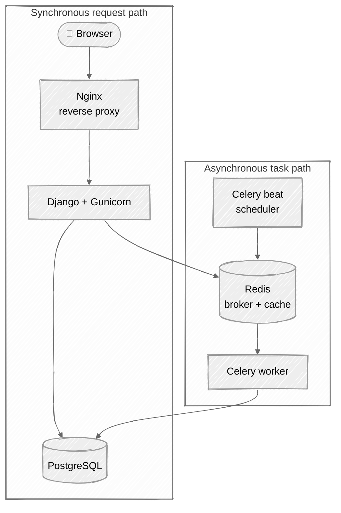

# Django Mastery: From Beginner to Expert

[](https://github.com/ichdamola/django-mentorship/stargazers)
[](https://github.com/ichdamola/django-mentorship/network/members)
[](https://github.com/ichdamola/django-mentorship/graphs/contributors)
[](https://github.com/ichdamola/django-mentorship/blob/main/LICENSE)

> A comprehensive 16-week Django mentorship curriculum designed to take you from complete beginner to production-ready expert.
> Built with modern tools, real-world projects, and a scalable submission system for **1000+ learners**.

🌟 **Star this repo** if you're learning Django or find it useful!  
🔀 **Fork it** to start your journey and submit your weekly work.

## 🎯 Program Overview

This curriculum is structured into weekly tasks, each building upon the previous. By the end, you'll have built multiple real-world projects and understand Django's internals deeply.

```
Week 01-04:  Foundation       → Python, Environment, Django Basics
Week 05-08:  Core Django      → Models, Views, Templates, Forms
Week 09-12:  Advanced Django  → REST APIs, Authentication, Testing
Week 13-16:  Production       → Deployment, Performance, Security
```

## 🏗️ What You'll Build

Across the 16 weeks you'll incrementally build **TaskMaster**, a production-ready task management application. By Week 15 the architecture looks like this — each layer wired up week by week:



| Phase | Weeks | What gets wired up |
| --- | --- | --- |
| Foundation | 01–04 | Python tooling, first Django project, models + migrations |
| Core Django | 05–08 | Views, templates, forms, admin |
| Advanced | 09–12 | Auth + custom user, REST API, pytest, advanced ORM |
| Production | 13–16 | Caching, Celery, Docker + CI/CD, capstone |

## 🛠️ Required Tools

We enforce modern, best-practice tooling throughout this program:

| Tool                                          | Purpose                          | Why Not Alternatives                                                    |
| --------------------------------------------- | -------------------------------- | ----------------------------------------------------------------------- |
| **[uv](https://docs.astral.sh/uv/)**          | Package & environment management | 10-100x faster than pip, replaces pip, pip-tools, virtualenv, and pyenv |
| **[ruff](https://docs.astral.sh/ruff/)**      | Linting & formatting             | Replaces flake8, black, isort - single tool, blazingly fast             |
| **[pytest](https://docs.pytest.org/)**        | Testing                          | More pythonic, better fixtures than unittest                            |
| **[pre-commit](https://pre-commit.com/)**     | Git hooks                        | Automate code quality checks                                            |
| **[Docker](https://www.docker.com/)**         | Containerization                 | Consistent environments                                                 |
| **[PostgreSQL](https://www.postgresql.org/)** | Database                         | Production-grade, what you'll use in real jobs                          |

## 📁 Curriculum & Progress

Each week is a self-contained folder with its own README, exercises, and weekly project. Open a week to begin, tick the box when you finish.

- [ ] Week 01: [Environment Setup](week-01-environment-setup) — Python, uv, Git fundamentals
- [ ] Week 02: [Python Foundations](week-02-python-foundations) — Python concepts for Django
- [ ] Week 03: [Django Introduction](week-03-django-intro) — First Django project
- [ ] Week 04: [Models Basics](week-04-models-basics) — ORM fundamentals
- [ ] Week 05: [Views & URLs](week-05-views-urls) — Request/response cycle
- [ ] Week 06: [Templates](week-06-templates) — Django template language
- [ ] Week 07: [Forms](week-07-forms) — Form handling & validation
- [ ] Week 08: [Admin](week-08-admin) — Django admin customization
- [ ] Week 09: [Authentication](week-09-authentication) — Users, permissions, sessions
- [ ] Week 10: [REST API](week-10-rest-api) — Django REST Framework
- [ ] Week 11: [Testing](week-11-testing) — pytest & test strategies
- [ ] Week 12: [Advanced ORM](week-12-advanced-orm) — Complex queries, optimization
- [ ] Week 13: [Caching & Performance](week-13-caching-performance) — Redis, query optimization
- [ ] Week 14: [Celery & Async](week-14-celery-async) — Background tasks
- [ ] Week 15: [Deployment](week-15-deployment) — Docker, CI/CD, production
- [ ] Week 16: [Capstone Project](week-16-capstone) — Final project

## 🚀 Getting Started

### 1. Fork & Clone This Repository

```bash
# Fork on GitHub first, then:
git clone https://github.com/YOUR_USERNAME/django-mentorship.git
cd django-mentorship
```

### 2. Install uv (Our Package Manager)

```bash
# macOS/Linux
curl -LsSf https://astral.sh/uv/install.sh | sh

# Windows
powershell -c "irm https://astral.sh/uv/install.ps1 | iex"

# Verify installation
uv --version
```

### 3. Start with Week 01

Navigate to `week-01-environment-setup/` and follow the README.

## 📋 Weekly Workflow

Each week follows this pattern:

1. **Read** the week's README completely
2. **Study** linked documentation sections
3. **Complete** the exercises in order
4. **Build** the weekly project in **your fork**
5. **Submit:** Create a branch `submission/<your-github-username>/week-XX`, push to your fork, and open a Pull Request to this repo's main (for review only – no merges!)
6. **Review:** Get feedback from mentors/community
   > Why this works at scale: Forks isolate work (no overrides), PRs allow unlimited reviews without touching main. Main repo stays clean with only challenges.

## 📚 Primary Resources

- [Django Official Documentation](https://docs.djangoproject.com/en/5.0/)
- [Django REST Framework](https://www.django-rest-framework.org/)
- [Two Scoops of Django](https://www.feldroy.com/books/two-scoops-of-django-3-x) (Recommended)
- [uv Documentation](https://docs.astral.sh/uv/)
- [ruff Documentation](https://docs.astral.sh/ruff/)

## 🎓 Learning Philosophy

1. **Type everything** - No copy-paste. Muscle memory matters.
2. **Read errors carefully** - They tell you exactly what's wrong.
3. **Use documentation first** - Before Stack Overflow, read the docs.
4. **Understand, don't memorize** - Know WHY, not just HOW.
5. **Build real things** - Theory without practice is useless.

## 🔗 Open Source & Contributing

This project is open source! Help make it better:

- Improve weeks/exercises
- Fix typos or add explanations
- Translate content

**Ready?** Start with [Week 01: Environment Setup](week-01-environment-setup)
