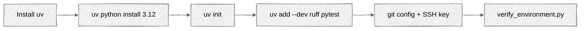

# Week 01: Environment Setup

## 🎯 Learning Objectives

By the end of this week, you will:

- Understand why proper tooling matters in professional development
- Have a fully configured Python development environment
- Know how to use `uv` for package and environment management
- Have Git configured with proper SSH authentication
- Understand the difference between system Python and project Python

The setup you'll do this week, in order:



## 📚 Required Reading

Before starting exercises, read these documentation sections:

| Resource                                                                    | Section                   | Time   |
| --------------------------------------------------------------------------- | ------------------------- | ------ |
| [uv Documentation](https://docs.astral.sh/uv/)                              | Getting Started, Concepts | 30 min |
| [Git Handbook](https://guides.github.com/introduction/git-handbook/)        | Entire guide              | 20 min |
| [Python Virtual Environments](https://docs.python.org/3/tutorial/venv.html) | Full page                 | 15 min |

## 🔧 Prerequisites

- A computer running macOS, Linux, or Windows (with WSL2)
- Basic terminal/command line familiarity
- A GitHub account

---

## Part 1: Understanding the Tools

### Why uv Instead of pip?

```
┌─────────────────────────────────────────────────────────────────-┐
│                    Traditional Python Tooling                    │
├────────────────────────────────────────────────────────────────-─┤
│                                                                  │
│   pyenv          virtualenv         pip          pip-tools       │
│     │                │                │              │           │
│     ▼                ▼                ▼              ▼           │
│  [Python]  ──► [Virtual Env] ──► [Install] ──► [Lock deps]       │
│  Versions       Creation          Packages       Versions        │
│                                                                  │
│   4 separate tools, different maintainers, inconsistent APIs     │
│                                                                  │
└─────────────────────────────────────────────────────────────────-┘

┌─────────────────────────────────────────────────────────────────-┐
│                         Modern: uv                               │
├─────────────────────────────────────────────────────────────────-┤
│                                                                  │
│                          uv                                      │
│                           │                                      │
│         ┌────────┬────────┼────────┬────────┐                    │
│         ▼        ▼        ▼        ▼        ▼                    │
│     [Python] [Venv]  [Install] [Lock]  [Run]                     │
│                                                                  │
│   Single tool, consistent API, 10-100x faster than pip           │
│                                                                  │
└─────────────────────────────────────────────────────────────────-┘
```

**Key Benefits:**

- **Speed**: Installing packages is 10-100x faster than pip
- **Reliability**: Deterministic dependency resolution
- **Simplicity**: One tool instead of four
- **Modern**: Built in Rust, actively maintained by Astral

### Project Structure Preview

Every Django project we create will follow this structure:

```
my-project/
├── pyproject.toml      # Project metadata & dependencies (replaces requirements.txt)
├── uv.lock             # Locked dependency versions (auto-generated)
├── .python-version     # Python version for this project
├── .venv/              # Virtual environment (auto-created by uv)
├── .gitignore          # Files to exclude from git
├── .pre-commit-config.yaml  # Code quality hooks
├── src/
│   └── my_project/     # Your Django project
└── tests/              # Test files
```

---

## Part 2: Installation

### Exercise 1.1: Install uv

**Task**: Install uv on your system.

**macOS/Linux:**

```bash
curl -LsSf https://astral.sh/uv/install.sh | sh
```

**Windows (PowerShell):**

```powershell
powershell -ExecutionPolicy ByPass -c "irm https://astral.sh/uv/install.ps1 | iex"
```

**Verification:**

```bash
# Close and reopen terminal, then:
uv --version
```

**Expected Output:**

```
uv 0.4.x (or higher)
```

> 📖 **Documentation**: [uv Installation](https://docs.astral.sh/uv/getting-started/installation/)

---

### Exercise 1.2: Install Python via uv

**Task**: Use uv to install Python 3.12 (we'll use this version throughout the course).

```bash
# List available Python versions
uv python list

# Install Python 3.12
uv python install 3.12

# Verify installation
uv python list --only-installed
```

> ⚠️ **Important**: We use `uv python install` instead of installing Python from python.org or homebrew. This ensures consistent versions across all your projects.

> 📖 **Documentation**: [uv Python Management](https://docs.astral.sh/uv/guides/install-python/)

---

### Exercise 1.3: Configure Git

**Task**: Set up Git with your identity and SSH key.

```bash
# Set your identity
git config --global user.name "Your Name"
git config --global user.email "your.email@example.com"

# Set default branch name
git config --global init.defaultBranch main

# Enable helpful colorization
git config --global color.ui auto

# Verify configuration
git config --list
```

**Generate SSH Key (if you don't have one):**

```bash
# Generate new SSH key
ssh-keygen -t ed25519 -C "your.email@example.com"

# Start SSH agent
eval "$(ssh-agent -s)"

# Add key to agent
ssh-add ~/.ssh/id_ed25519

# Display public key (copy this to GitHub)
cat ~/.ssh/id_ed25519.pub
```

**Add to GitHub:**

1. Go to GitHub → Settings → SSH and GPG keys
2. Click "New SSH key"
3. Paste your public key
4. Test connection: `ssh -T git@github.com`

> 📖 **Documentation**: [GitHub SSH Setup](https://docs.github.com/en/authentication/connecting-to-github-with-ssh)

---

## Part 3: Your First uv Project

### Exercise 1.4: Create a Project

**Task**: Create your first Python project using uv.

```bash
# Create a new directory for week 01 work
mkdir -p ~/django-learning/week-01
cd ~/django-learning/week-01

# Initialize a new Python project
uv init hello-python

# Enter the project
cd hello-python

# Examine what was created
ls -la
```

**Expected Structure:**

```
hello-python/
├── .python-version    # Contains "3.12"
├── pyproject.toml     # Project configuration
├── README.md          # Project readme
└── hello.py           # Sample Python file
```

**Examine pyproject.toml:**

```bash
cat pyproject.toml
```

**Expected Content:**

```toml
[project]
name = "hello-python"
version = "0.1.0"
description = "Add your description here"
readme = "README.md"
requires-python = ">=3.12"
dependencies = []
```

> 📖 **Documentation**: [uv Projects](https://docs.astral.sh/uv/guides/projects/)

---

### Exercise 1.5: Add Dependencies

**Task**: Learn how uv manages dependencies.

```bash
# Add a dependency
uv add requests

# See what changed
cat pyproject.toml

# Notice the new lock file
ls -la
cat uv.lock | head -50
```

**Understanding the Lock File:**

```
┌──────────────────────────────────────────────────────────────-────┐
│                    Dependency Resolution                          │
├───────────────────────────────────────────────────────────────-───┤
│                                                                   │
│  pyproject.toml                      uv.lock                      │
│  ─────────────                       ───────                      │
│  dependencies = [                    Exact versions:              │
│    "requests"      ──────────────►   requests==2.31.0             │
│  ]                   uv resolves     urllib3==2.1.0               │
│                      and locks       certifi==2024.2.2            │
│  (flexible)                          charset-normalizer==3.3.2    │
│                                      idna==3.6                    │
│                                      (precise & reproducible)     │
│                                                                   │
└────────────────────────────────────────────────────────────────-──┘
```

**Why Lock Files Matter:**

- **Reproducibility**: Everyone gets exact same versions
- **Security**: Pinned versions, known checksums
- **Collaboration**: No "works on my machine" issues

```bash
# Add a development dependency (not needed in production)
uv add --dev pytest ruff

# View updated pyproject.toml
cat pyproject.toml
```

> 📖 **Documentation**: [uv Dependencies](https://docs.astral.sh/uv/concepts/dependencies/)

---

### Exercise 1.6: Run Python Code

**Task**: Execute Python code using uv.

**Create a test script:**

```bash
cat > hello.py << 'EOF'
import requests

def main():
    response = requests.get("https://api.github.com")
    print(f"GitHub API Status: {response.status_code}")
    print(f"Rate Limit: {response.headers.get('X-RateLimit-Limit')}")

if __name__ == "__main__":
    main()
EOF
```

**Run with uv:**

```bash
# uv automatically uses the project's virtual environment
uv run python hello.py
```

**Expected Output:**

```
GitHub API Status: 200
Rate Limit: 60
```

> ⚠️ **Key Insight**: `uv run` ensures your code runs in the correct virtual environment with all dependencies available. Never activate virtual environments manually - use `uv run` instead.

---

### Exercise 1.7: Install ruff for Code Quality

**Task**: Set up ruff for linting and formatting.

```bash
# ruff should already be installed as dev dependency
# Create a ruff configuration in pyproject.toml
cat >> pyproject.toml << 'EOF'

[tool.ruff]
line-length = 88
target-version = "py312"

[tool.ruff.lint]
select = [
    "E",   # pycodestyle errors
    "W",   # pycodestyle warnings
    "F",   # pyflakes
    "I",   # isort
    "B",   # flake8-bugbear
    "C4",  # flake8-comprehensions
    "UP",  # pyupgrade
]

[tool.ruff.format]
quote-style = "double"
EOF
```

**Test ruff:**

```bash
# Create a file with style issues
cat > messy.py << 'EOF'
import os
import sys
import requests
x=1
y =2
def foo(   ):
    unused_var = "hello"
    return x+y
EOF

# Check for issues
uv run ruff check messy.py

# Auto-fix issues
uv run ruff check --fix messy.py

# Format the code
uv run ruff format messy.py

# View the cleaned code
cat messy.py
```

> 📖 **Documentation**: [Ruff Configuration](https://docs.astral.sh/ruff/configuration/)

---

## Part 4: Version Control

### Exercise 1.8: Git Workflow

**Task**: Initialize git and make your first commit.

```bash
# Create .gitignore
cat > .gitignore << 'EOF'
# Python
__pycache__/
*.py[cod]
*$py.class
*.so
.Python
.venv/
venv/
ENV/

# uv
.uv/

# IDE
.idea/
.vscode/
*.swp
*.swo

# OS
.DS_Store
Thumbs.db

# Testing
.pytest_cache/
.coverage
htmlcov/

# Distribution
dist/
build/
*.egg-info/
EOF

# Initialize repository
git init

# Stage all files
git add .

# Check status
git status

# Make first commit
git commit -m "Initial commit: Hello Python project with uv"

# View commit history
git log --oneline
```

---

## 📝 Weekly Project: Environment Verification Script

**Task**: Create a script that verifies your entire development environment is correctly configured.

Create `verify_environment.py`:

```python
#!/usr/bin/env python3
"""
Environment Verification Script
Checks that all required tools are properly installed and configured.
"""

import shutil
import subprocess
import sys


def check_command(name: str, command: list[str], expected_in_output: str = "") -> bool:
    """Check if a command exists and runs successfully."""
    print(f"Checking {name}...", end=" ")

    path = shutil.which(command[0])
    if not path:
        print(f"❌ {command[0]} not found in PATH")
        return False

    try:
        result = subprocess.run(
            command,
            capture_output=True,
            text=True,
            timeout=10,
        )
        if expected_in_output and expected_in_output not in result.stdout + result.stderr:
            print(f"❌ Unexpected output")
            return False
        print(f"✅ Found at {path}")
        return True
    except subprocess.TimeoutExpired:
        print("❌ Command timed out")
        return False
    except Exception as e:
        print(f"❌ Error: {e}")
        return False


def check_python_version() -> bool:
    """Verify Python version is 3.12+."""
    print("Checking Python version...", end=" ")
    version = sys.version_info
    # Tuple comparison - `major >= 3 and minor >= 12` would reject Python
    # 4.0 (minor 0 < 12) even though it satisfies "3.12+".
    if version >= (3, 12):
        print(f"✅ Python {version.major}.{version.minor}.{version.micro}")
        return True
    print(f"❌ Python {version.major}.{version.minor} (need 3.12+)")
    return False


def check_git_config() -> bool:
    """Verify Git is configured with name and email."""
    print("Checking Git configuration...", end=" ")
    try:
        name = subprocess.run(
            ["git", "config", "user.name"],
            capture_output=True,
            text=True,
        )
        email = subprocess.run(
            ["git", "config", "user.email"],
            capture_output=True,
            text=True,
        )
        if name.stdout.strip() and email.stdout.strip():
            print(f"✅ {name.stdout.strip()} <{email.stdout.strip()}>")
            return True
        print("❌ Name or email not configured")
        return False
    except Exception as e:
        print(f"❌ Error: {e}")
        return False


def main() -> int:
    """Run all environment checks."""
    print("=" * 60)
    print("Django Mentorship - Environment Verification")
    print("=" * 60)
    print()

    checks = [
        ("Python Version", check_python_version),
        ("uv", lambda: check_command("uv", ["uv", "--version"])),
        ("Git", lambda: check_command("git", ["git", "--version"])),
        ("Git Config", check_git_config),
        ("ruff", lambda: check_command("ruff", ["uv", "run", "ruff", "--version"])),
        ("pytest", lambda: check_command("pytest", ["uv", "run", "pytest", "--version"])),
    ]

    results = []
    for name, check_func in checks:
        results.append(check_func())

    print()
    print("=" * 60)
    passed = sum(results)
    total = len(results)

    if passed == total:
        print(f"✅ All checks passed! ({passed}/{total})")
        print("Your environment is ready for Django development.")
        return 0
    else:
        print(f"⚠️  {passed}/{total} checks passed")
        print("Please fix the issues above before proceeding.")
        return 1


if __name__ == "__main__":
    sys.exit(main())
```

**Run verification:**

```bash
uv run python verify_environment.py
```

**Expected Output (all green):**

```
============================================================
Django Mentorship - Environment Verification
============================================================

Checking Python version... ✅ Python 3.12.x
Checking uv... ✅ Found at /path/to/uv
Checking Git... ✅ Found at /usr/bin/git
Checking Git configuration... ✅ Your Name <your@email.com>
Checking ruff... ✅ Found at /path/to/ruff
Checking pytest... ✅ Found at /path/to/pytest

============================================================
✅ All checks passed! (6/6)
Your environment is ready for Django development.
```

---

## 📋 Submission Checklist

Before moving to Week 02, ensure you can check ALL boxes:

- [ ] `uv --version` shows version 0.4.0 or higher
- [ ] `uv python list --only-installed` shows Python 3.12
- [ ] `git config user.name` shows your name
- [ ] `git config user.email` shows your email
- [ ] `ssh -T git@github.com` authenticates successfully
- [ ] Created `hello-python` project with uv
- [ ] `uv run python verify_environment.py` passes all checks
- [ ] Project is committed to git with proper .gitignore

---

## 🔗 Additional Resources

- [uv GitHub Repository](https://github.com/astral-sh/uv)
- [Why Astral is Building uv](https://astral.sh/blog/uv)
- [Git Immersion Tutorial](https://gitimmersion.com/)
- [Oh Shit, Git!](https://ohshitgit.com/) - Common Git mistakes and fixes

---

## ❓ Common Issues

### "uv: command not found"

Restart your terminal after installation, or add uv to your PATH manually.

### "Permission denied" when installing

On Linux/Mac, you may need to use `sudo` for system-wide installation, or install to user directory.

### SSH key issues

Ensure the SSH agent is running: `eval "$(ssh-agent -s)"`

---

**Next**: [Week 02: Python Foundations →](../week-02-python-foundations)
