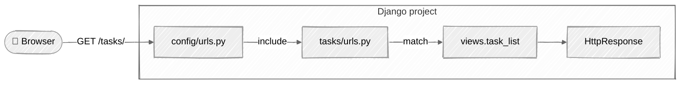

# Week 03: Django Introduction

## 🎯 Learning Objectives

By the end of this week, you will:

- Understand Django's architecture and philosophy
- Create your first Django project with proper structure
- Understand the request/response cycle
- Configure Django settings properly
- Work with Django's development server

By the end of the week your request will travel this path:



## 📚 Required Reading

| Resource                                                                          | Section       | Time   |
| --------------------------------------------------------------------------------- | ------------- | ------ |
| [Django Overview](https://docs.djangoproject.com/en/5.0/intro/overview/)          | Full page     | 15 min |
| [Django Tutorial Part 1](https://docs.djangoproject.com/en/5.0/intro/tutorial01/) | Full tutorial | 30 min |
| [Django Settings](https://docs.djangoproject.com/en/5.0/topics/settings/)         | Full page     | 20 min |

---

## Part 1: Understanding Django's Architecture

```
┌─────────────────────────────────────────────────────────────────┐
│                    The Request/Response Cycle                    │
├─────────────────────────────────────────────────────────────────┤
│                                                                  │
│   Browser ──► URLs ──► View ──► Template ──► Response           │
│                          │                                       │
│                          ▼                                       │
│                        Model                                     │
│                          │                                       │
│                          ▼                                       │
│                       Database                                   │
│                                                                  │
└─────────────────────────────────────────────────────────────────┘
```

---

## Part 2: Project Setup

### Exercise 3.1: Create Django Project

```bash
mkdir -p ~/django-learning/week-03
cd ~/django-learning/week-03

uv init taskmaster
cd taskmaster

uv add django
uv run django-admin startproject config .
```

### Exercise 3.2: Run Development Server

```bash
uv run python manage.py migrate
uv run python manage.py runserver
```

Visit http://127.0.0.1:8000 to see Django's welcome page.

---

## Part 3: Create Your First App

### Exercise 3.3: Create Tasks App

```bash
uv run python manage.py startapp tasks
```

Add to `config/settings.py`:

```python
INSTALLED_APPS = [
    # ... default apps ...
    'tasks',
]
```

---

## Part 4: Views and URLs

### Exercise 3.4: Create Views

Edit `tasks/views.py`:

```python
from django.http import HttpRequest, HttpResponse

def index(request: HttpRequest) -> HttpResponse:
    return HttpResponse("<h1>TaskMaster</h1><p>Welcome to your task manager!</p>")

def task_list(request: HttpRequest) -> HttpResponse:
    tasks = [
        {"id": 1, "title": "Learn Django", "status": "in_progress"},
        {"id": 2, "title": "Build an app", "status": "pending"},
    ]
    html = "<h1>Tasks</h1><ul>"
    for task in tasks:
        html += f"<li><a href='/tasks/{task['id']}/'>{task['title']}</a> - {task['status']}</li>"
    html += "</ul>"
    return HttpResponse(html)

def task_detail(request: HttpRequest, task_id: int) -> HttpResponse:
    return HttpResponse(f"<h1>Task #{task_id}</h1>")
```

### Exercise 3.5: Create URLs

Create `tasks/urls.py`:

```python
from django.urls import path
from . import views

app_name = "tasks"

urlpatterns = [
    path("", views.index, name="index"),
    path("tasks/", views.task_list, name="task_list"),
    path("tasks/<int:task_id>/", views.task_detail, name="task_detail"),
]
```

Update `config/urls.py`:

```python
from django.contrib import admin
from django.urls import path, include

urlpatterns = [
    path("admin/", admin.site.urls),
    path("", include("tasks.urls")),
]
```

---

## Part 5: Environment Configuration

### Exercise 3.6: Add Environment Variables

```bash
uv add python-decouple
```

Create `.env`:

```
DEBUG=True
SECRET_KEY=your-secret-key-here
```

Update `config/settings.py`:

```python
from decouple import config

SECRET_KEY = config('SECRET_KEY')
DEBUG = config('DEBUG', default=False, cast=bool)
```

---

## 📝 Weekly Project

Build TaskMaster with these pages:

- Home (`/`) - Welcome message
- Task List (`/tasks/`) - List all tasks
- Task Detail (`/tasks/<id>/`) - Show single task
- About (`/about/`) - About page
- Stats (`/stats/`) - Task statistics

Each page should have proper HTML structure and navigation links.

---

## 📋 Submission Checklist

- [ ] Django project created with uv
- [ ] Tasks app created and registered
- [ ] All views working
- [ ] URLs properly configured
- [ ] Environment variables set up
- [ ] Code passes ruff checks

---

**Next**: [Week 04: Models Basics →](../week-04-models-basics)
