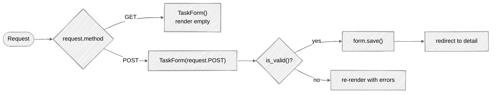

# Week 07: Django Forms

## 🎯 Learning Objectives

- Create and validate forms with Django Forms
- Use ModelForms for database-backed forms
- Handle file uploads
- Implement custom form validation
- Work with formsets

The form lifecycle you'll handle in your view — GET renders, POST validates and either saves or re-renders with errors:



## 📚 Required Reading

| Resource                                                                       | Section   | Time   |
| ------------------------------------------------------------------------------ | --------- | ------ |
| [Working with Forms](https://docs.djangoproject.com/en/5.0/topics/forms/)      | Full page | 45 min |
| [ModelForms](https://docs.djangoproject.com/en/5.0/topics/forms/modelforms/)   | Full page | 30 min |
| [Form Validation](https://docs.djangoproject.com/en/5.0/ref/forms/validation/) | Full page | 30 min |

---

## Key Concepts

### Form Types

```python
# tasks/forms.py
from django import forms
from django.utils import timezone

from .models import Task, Category


# Basic Form (not tied to model)
class ContactForm(forms.Form):
    name = forms.CharField(max_length=100)
    email = forms.EmailField()
    message = forms.CharField(widget=forms.Textarea)


# ModelForm (tied to model)
class TaskForm(forms.ModelForm):
    class Meta:
        model = Task
        fields = ['title', 'description', 'priority', 'status', 'category', 'due_date', 'tags']
        widgets = {
            'description': forms.Textarea(attrs={'rows': 4}),
            'due_date': forms.DateInput(attrs={'type': 'date'}),
            'tags': forms.CheckboxSelectMultiple(),
        }

    def clean_title(self):
        """Custom field validation."""
        title = self.cleaned_data['title']
        if len(title) < 3:
            raise forms.ValidationError("Title must be at least 3 characters.")
        return title

    def clean(self):
        """Cross-field validation."""
        cleaned_data = super().clean()
        status = cleaned_data.get('status')
        due_date = cleaned_data.get('due_date')

        if status == 'completed' and due_date and due_date > timezone.now().date():
            raise forms.ValidationError(
                "Completed tasks cannot have a future due date."
            )
        return cleaned_data
```

### Using Forms in Views

```python
# Function-based view
def task_create(request):
    if request.method == 'POST':
        form = TaskForm(request.POST)
        if form.is_valid():
            task = form.save()
            messages.success(request, 'Task created!')
            return redirect('tasks:task_detail', pk=task.pk)
    else:
        form = TaskForm()

    return render(request, 'tasks/task_form.html', {'form': form})


# Class-based view
class TaskCreateView(CreateView):
    model = Task
    form_class = TaskForm
    template_name = 'tasks/task_form.html'
    success_url = reverse_lazy('tasks:task_list')
```

### Form Template

```html
 
<h1>EditCreate Task</h1>

<form method="post" novalidate>
   
  <div class="mb-3">
    <label for="{{ field.id_for_label }}" class="form-label">
      {{ field.label }} <span class="text-danger"
        >*</span
      >
    </label>
    {{ field }} 
    <div class="invalid-feedback d-block">
      {{ error }}
    </div>
     
    <small class="form-text text-muted">{{ field.help_text }}</small>
    
  </div>
  

  <button type="submit" class="btn btn-primary">Save</button>
  <a href="" class="btn btn-secondary">Cancel</a>
</form>

```

---

## Part 2: File uploads

Add an attachment to `Task`. First, configure media handling in `config/settings.py`:

```python
# config/settings.py
MEDIA_URL = '/media/'
MEDIA_ROOT = BASE_DIR / 'media'
```

```python
# config/urls.py
from django.conf import settings
from django.conf.urls.static import static

urlpatterns = [
    # ...
]

if settings.DEBUG:
    urlpatterns += static(settings.MEDIA_URL, document_root=settings.MEDIA_ROOT)
```

Add the model field:

```python
# tasks/models.py
class TaskAttachment(models.Model):
    task = models.ForeignKey(Task, related_name='attachments', on_delete=models.CASCADE)
    file = models.FileField(upload_to='task_attachments/%Y/%m/')
    uploaded_at = models.DateTimeField(auto_now_add=True)

    def __str__(self) -> str:
        return self.file.name
```

The form with validation:

```python
# tasks/forms.py
class TaskAttachmentForm(forms.ModelForm):
    MAX_BYTES = 5 * 1024 * 1024  # 5 MB
    ALLOWED_TYPES = {'application/pdf', 'image/png', 'image/jpeg', 'image/gif'}

    class Meta:
        model = TaskAttachment
        fields = ['file']

    def clean_file(self):
        f = self.cleaned_data['file']
        if f.size > self.MAX_BYTES:
            raise forms.ValidationError(
                f"File too large ({f.size // 1024} KB > {self.MAX_BYTES // 1024} KB)."
            )
        # content_type is set by the client — trust but verify with magic bytes
        # in production (see Week 12 of appsec-mentorship for the right pattern).
        if f.content_type not in self.ALLOWED_TYPES:
            raise forms.ValidationError(
                f"Unsupported type: {f.content_type}. Allowed: {', '.join(self.ALLOWED_TYPES)}."
            )
        return f
```

**Important:** a form that uploads files **must** set `enctype="multipart/form-data"` on the `<form>` tag, AND the view must pass `request.FILES` into the form:

```python
def upload_attachment(request, task_id):
    task = get_object_or_404(Task, pk=task_id)
    if request.method == 'POST':
        form = TaskAttachmentForm(request.POST, request.FILES)  # ← request.FILES!
        if form.is_valid():
            attachment = form.save(commit=False)
            attachment.task = task
            attachment.save()
            return redirect('tasks:task_detail', pk=task.pk)
    else:
        form = TaskAttachmentForm()
    return render(request, 'tasks/attachment_form.html', {'form': form, 'task': task})
```

```html
<form method="post" enctype="multipart/form-data">   {# ← enctype is the easy one to forget #}
    
    {{ form.as_p }}
    <button type="submit">Upload</button>
</form>
```

---

## Part 3: Formsets — editing many objects on one page

A **formset** is a collection of the same form, rendered as one HTML form, validated as a batch. Two flavors:

- **`formset_factory(MyForm)`** — N independent forms of the same type
- **`modelformset_factory(MyModel, fields=[...])`** — N forms tied to model instances
- **`inlineformset_factory(Parent, Child, fields=[...])`** — N child forms tied to ONE parent (the most common — "edit a Task and all its attachments at once")

### Inline formset — edit Task with its Attachments

```python
# tasks/forms.py
from django.forms import inlineformset_factory

TaskAttachmentFormSet = inlineformset_factory(
    Task,                       # parent
    TaskAttachment,              # child
    fields=['file'],
    extra=2,                    # 2 blank rows for new uploads
    can_delete=True,            # show a "delete" checkbox per row
    max_num=10,                 # safety cap
)
```

```python
# tasks/views.py
def task_with_attachments(request, pk):
    task = get_object_or_404(Task, pk=pk)

    if request.method == 'POST':
        form = TaskForm(request.POST, instance=task)
        formset = TaskAttachmentFormSet(request.POST, request.FILES, instance=task)
        if form.is_valid() and formset.is_valid():
            form.save()
            formset.save()
            return redirect('tasks:task_detail', pk=task.pk)
    else:
        form = TaskForm(instance=task)
        formset = TaskAttachmentFormSet(instance=task)

    return render(request, 'tasks/task_with_attachments.html', {
        'form': form,
        'formset': formset,
        'task': task,
    })
```

```html
{# tasks/templates/tasks/task_with_attachments.html #}
<form method="post" enctype="multipart/form-data">
    
    {{ form.as_p }}

    <h3>Attachments</h3>
    {{ formset.management_form }}    {# REQUIRED — formset state #}
    
        <fieldset class="attachment-row">
            {{ child_form.as_p }}
            
                <label>{{ child_form.DELETE }} Delete this attachment</label>
            
        </fieldset>
    

    <button type="submit">Save all</button>
</form>
```

> ⚠️ **`{{ formset.management_form }}` is not optional.** It renders the hidden inputs Django uses to track how many forms exist, how many are new, etc. Without it, you get `ValidationError: ManagementForm data is missing or has been tampered with`.

### Adding/removing rows dynamically (one-line JS sketch)

For a UX-quality "add another attachment" button, clone the last row in the formset and bump the `TOTAL_FORMS` counter:

```html
<button type="button" onclick="addAttachmentRow()">+ Add another</button>
<script>
function addAttachmentRow() {
    const total = document.querySelector('input[name="attachments-TOTAL_FORMS"]');
    const rows = document.querySelectorAll('.attachment-row');
    const last = rows[rows.length - 1];
    const idx = parseInt(total.value);
    const clone = last.cloneNode(true);
    clone.innerHTML = clone.innerHTML.replace(/-\d+-/g, `-${idx}-`).replace(/_\d+_/g, `_${idx}_`);
    last.after(clone);
    total.value = idx + 1;
}
</script>
```

In real projects use `django-formset-js`, `htmx`, or a frontend framework — but knowing how the underlying TOTAL_FORMS counter works is the senior cue.

---

## Part 4: Multi-step forms (the session-based pattern)

When a form is too long for one screen (signup wizards, surveys, multi-page checkouts), split it into steps. The simplest pattern uses the session as scratch storage:

```python
# tasks/views.py
def task_wizard_step_1(request):
    if request.method == 'POST':
        form = TaskBasicsForm(request.POST)
        if form.is_valid():
            request.session['task_wizard_step1'] = form.cleaned_data
            return redirect('tasks:wizard_step_2')
    else:
        form = TaskBasicsForm(initial=request.session.get('task_wizard_step1'))
    return render(request, 'tasks/wizard_step_1.html', {'form': form})


def task_wizard_step_2(request):
    if 'task_wizard_step1' not in request.session:
        return redirect('tasks:wizard_step_1')   # don't let someone jump ahead

    if request.method == 'POST':
        form = TaskDetailsForm(request.POST)
        if form.is_valid():
            step1 = request.session.pop('task_wizard_step1')
            Task.objects.create(**step1, **form.cleaned_data)
            return redirect('tasks:task_list')
    else:
        form = TaskDetailsForm()
    return render(request, 'tasks/wizard_step_2.html', {'form': form})
```

For anything more complex, use [`django-formtools`](https://django-formtools.readthedocs.io/) which ships `WizardView` with backed-by-session and backed-by-cookie variants. The principle is the same.

---

## Part 5: Custom validators (reusable across forms)

When you find yourself writing the same `clean_x()` logic across two forms, extract it:

```python
# tasks/validators.py
from django.core.exceptions import ValidationError

def validate_no_profanity(value: str) -> None:
    banned = {'spam', 'badword'}
    if any(w in value.lower() for w in banned):
        raise ValidationError("Please choose different language.")
```

Then in the model OR the form:

```python
# In model — runs on every full_clean() and on ModelForm validation
class Task(models.Model):
    title = models.CharField(max_length=200, validators=[validate_no_profanity])

# In form field directly
class TaskForm(forms.ModelForm):
    title = forms.CharField(max_length=200, validators=[validate_no_profanity])
```

Validators run *after* type coercion but *before* `clean_<field>()`. Order matters when you stack them.

---

## Part 6: When to use Form vs ModelForm vs serializer

| Use case | Pick |
|---|---|
| Submit a record to the database | `ModelForm` |
| Contact form, signup-flow that doesn't directly save a model | `Form` |
| API endpoint (JSON in, JSON out) | DRF `Serializer` ([Week 10](../week-10-rest-api/)) |
| Search filters | `Form` (often unbound for display, bound on query) |
| Multi-model save in one view | A `Form` whose `save()` orchestrates multiple `Model.objects.create()` calls — keep the multi-model save logic in the form, not the view. |

The simplest test: if the form maps 1:1 to a single model's fields, `ModelForm` saves you boilerplate. Anything else, `Form` is more honest.

---

## 📋 Submission Checklist

- [ ] TaskForm with `clean_title` + `clean()` cross-field validation, rendering with error display
- [ ] File-upload form for `TaskAttachment` with size + content-type validation
- [ ] Inline formset on the task-edit page so a user can edit Task and attachments together
- [ ] (Stretch) Multi-step wizard for a new "Task with subtasks" creation flow
- [ ] (Stretch) Custom validator extracted into `tasks/validators.py` and reused in 2+ places

---

**Next**: [Week 08: Admin →](../week-08-admin/readme.md)
