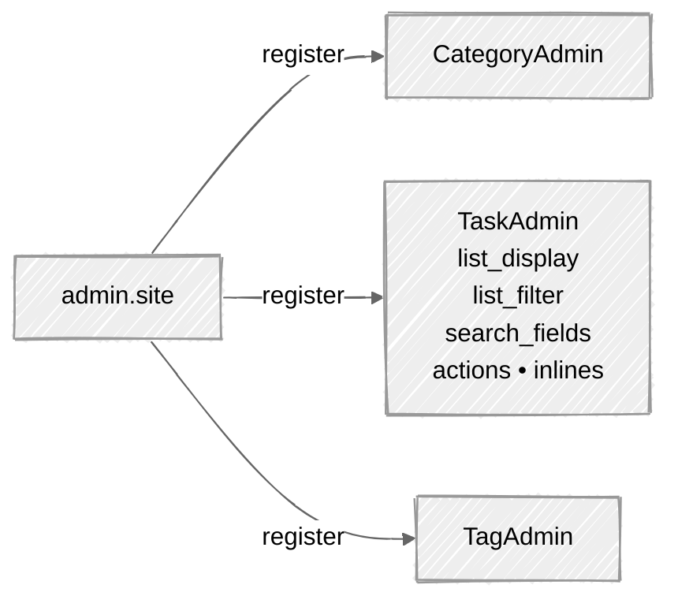

# Week 08: Django Admin Customization

## 🎯 Learning Objectives

- Configure Django admin for your models
- Customize list views, filters, and search
- Create custom admin actions
- Use inlines for related models
- Customize admin forms and templates

Each model gets its own ModelAdmin registered with the admin site:



## 📚 Required Reading

| Resource                                                                          | Section   | Time   |
| --------------------------------------------------------------------------------- | --------- | ------ |
| [Django Admin Site](https://docs.djangoproject.com/en/5.0/ref/contrib/admin/)     | Full page | 60 min |
| [Admin Actions](https://docs.djangoproject.com/en/5.0/ref/contrib/admin/actions/) | Full page | 20 min |

---

## Key Concepts

### Basic Admin Registration

```python
# tasks/admin.py
from django.contrib import admin
from django.utils.html import format_html
from .models import Task, Category, Tag


@admin.register(Category)
class CategoryAdmin(admin.ModelAdmin):
    list_display = ['name', 'colored_badge', 'task_count', 'created_at']
    search_fields = ['name', 'description']
    readonly_fields = ['created_at']

    def colored_badge(self, obj):
        return format_html(
            '<span style="background-color: {}; padding: 3px 10px; '
            'border-radius: 3px; color: white;">{}</span>',
            obj.color, obj.name
        )
    colored_badge.short_description = 'Badge'

    def task_count(self, obj):
        return obj.tasks.count()
    task_count.short_description = 'Tasks'


class TaskAttachmentInline(admin.TabularInline):
    """Inline editor for attachments - appears inside the Task change form."""
    model = TaskAttachment
    extra = 1
    fields = ['file', 'uploaded_at']
    readonly_fields = ['uploaded_at']


@admin.register(Task)
class TaskAdmin(admin.ModelAdmin):
    list_display = ['title', 'status', 'priority', 'category', 'due_date', 'is_overdue']
    list_filter = ['status', 'priority', 'category', 'created_at']
    # ↑ Part 2 below adds the `OverdueFilter` class; reference it by class
    #   (NOT a string) once it's defined: `list_filter = [..., OverdueFilter]`.
    search_fields = ['title', 'description']
    list_editable = ['status', 'priority']
    list_select_related = ['category']   # avoids N+1 on list view (see Week 12)
    date_hierarchy = 'created_at'
    ordering = ['-created_at']
    autocomplete_fields = ['category']   # ← swap dropdown for searchable autocomplete
                                          #   when the dropdown grows past ~20 items
    inlines = [TaskAttachmentInline]     # ← inline the attachments editor

    fieldsets = [
        (None, {
            'fields': ['title', 'description']
        }),
        ('Status', {
            'fields': ['status', 'priority', 'category']
        }),
        ('Dates', {
            'fields': ['due_date', 'created_at', 'updated_at', 'completed_at'],
            'classes': ['collapse']
        }),
        ('Tags', {
            'fields': ['tags'],
        }),
    ]
    readonly_fields = ['created_at', 'updated_at', 'completed_at']
    filter_horizontal = ['tags']

    # Custom actions
    actions = ['mark_completed', 'mark_pending', 'export_as_csv']

    @admin.action(description='Mark selected tasks as completed')
    def mark_completed(self, request, queryset):
        updated = queryset.update(status='completed')
        self.message_user(request, f'{updated} tasks marked as completed.')

    @admin.action(description='Mark selected tasks as pending')
    def mark_pending(self, request, queryset):
        updated = queryset.update(status='pending')
        self.message_user(request, f'{updated} tasks marked as pending.')

    def is_overdue(self, obj):
        return obj.is_overdue
    is_overdue.boolean = True
    is_overdue.short_description = 'Overdue?'


@admin.register(Tag)
class TagAdmin(admin.ModelAdmin):
    list_display = ['name', 'task_count']
    search_fields = ['name']

    def task_count(self, obj):
        return obj.tasks.count()
```

### Create Superuser

```bash
uv run python manage.py createsuperuser
```

---

## Part 2: Custom list filters

`list_filter = ['status']` gives you a sidebar filter automatically. For computed conditions (e.g. "overdue tasks") you need a `SimpleListFilter`:

```python
# tasks/admin.py
from django.contrib.admin import SimpleListFilter
from django.utils import timezone

class OverdueFilter(SimpleListFilter):
    title = 'overdue status'
    parameter_name = 'overdue'         # appears in the URL as ?overdue=yes

    def lookups(self, request, model_admin):
        return [
            ('yes', 'Overdue'),
            ('no', 'On time'),
        ]

    def queryset(self, request, queryset):
        today = timezone.now().date()
        if self.value() == 'yes':
            return queryset.filter(due_date__lt=today).exclude(status='completed')
        if self.value() == 'no':
            return queryset.exclude(due_date__lt=today)
        return queryset
```

Add it to `list_filter` - pass the **class**, not a string:

```python
class TaskAdmin(admin.ModelAdmin):
    list_filter = ['status', 'priority', 'category', 'created_at', OverdueFilter]
```

---

## Part 3: Custom admin actions

Actions appear in the dropdown above the list view. The simplest form:

```python
@admin.action(description='Mark selected tasks as completed')
def mark_completed(self, request, queryset):
    updated = queryset.update(status='completed', completed_at=timezone.now())
    self.message_user(request, f'{updated} tasks marked as completed.')
```

For an action that **exports to CSV**:

```python
import csv
from django.http import HttpResponse

@admin.action(description='Export selected to CSV')
def export_as_csv(self, request, queryset):
    response = HttpResponse(content_type='text/csv')
    response['Content-Disposition'] = 'attachment; filename="tasks.csv"'

    writer = csv.writer(response)
    writer.writerow(['title', 'status', 'priority', 'due_date', 'category'])
    for task in queryset.select_related('category'):   # avoid N+1 in the loop
        writer.writerow([
            task.title,
            task.status,
            task.get_priority_display(),
            task.due_date or '',
            task.category.name if task.category else '',
        ])
    return response
```

Two non-obvious things about actions:

1. **`queryset.update()` does NOT trigger `save()`** - no signals, no `auto_now`. If you need those, iterate (`for obj in queryset: obj.status = '...'; obj.save()`) and accept the N writes.
2. Actions that touch many rows should be paginated or queued. For 100k+ rows, kick off a Celery task ([Week 14](../week-14-celery-async/)) instead of doing the work synchronously.

---

## Part 4: Admin permissions

> ⚠️ **Pre-req: requires `Task.owner` from Week 09.** The examples in Parts
> 4 and 5 reference `obj.owner` and `request.user`. If you're walking the
> curriculum linearly, **come back here after you complete Week 09's owner
> FK migration.** Until then, skip to Part 6. Trying to run this admin
> against the Week 04 `Task` model raises `FieldError: Cannot resolve
> keyword 'owner' into field`.

By default every staff user with `is_staff=True` can see the admin and act on models they have permissions for. Three permission classes are auto-generated per model: `add_taskname`, `change_taskname`, `delete_taskname`, `view_taskname`.

For finer-grained control, override the permission hooks:

```python
class TaskAdmin(admin.ModelAdmin):
    def has_delete_permission(self, request, obj=None):
        # Only superusers can delete tasks
        return request.user.is_superuser

    def has_change_permission(self, request, obj=None):
        # Anyone with the perm can change tasks they OWN; superuser can change all
        if obj is None:
            return super().has_change_permission(request)
        return request.user.is_superuser or obj.owner == request.user

    def get_queryset(self, request):
        # Restrict the list view to objects the user owns (unless superuser)
        qs = super().get_queryset(request)
        if request.user.is_superuser:
            return qs
        return qs.filter(owner=request.user)
```

> ⚠️ **`get_queryset` is the place to enforce row-level visibility, not template logic.** A field listed in `list_display` *will* render if the row appears in the queryset. Filter at the queryset level, not by hiding columns.

---

## Part 5: Save hooks - `save_model`, `save_formset`

Run logic when the admin saves a Task - e.g., automatically setting the owner on create:

```python
class TaskAdmin(admin.ModelAdmin):
    def save_model(self, request, obj, form, change):
        if not change:                        # `change` is False on first save
            obj.owner = request.user
        super().save_model(request, obj, form, change)
```

For inlines (the attachments attached to the Task), `save_formset` is the equivalent. The example below assumes you've added an `uploaded_by` FK to `TaskAttachment` - Week 07's model only has `(task, file, uploaded_at)`, so add this field first:

```python
# tasks/models.py - extend TaskAttachment if you want save_formset auditing
class TaskAttachment(models.Model):
    task = models.ForeignKey(Task, related_name='attachments', on_delete=models.CASCADE)
    file = models.FileField(upload_to='task_attachments/%Y/%m/')
    uploaded_at = models.DateTimeField(auto_now_add=True)
    uploaded_by = models.ForeignKey(                                  # ← add this
        settings.AUTH_USER_MODEL,
        null=True, blank=True,
        on_delete=models.SET_NULL,
        related_name='uploaded_attachments',
    )
```

Then the admin hook:

```python
    def save_formset(self, request, form, formset, change):
        instances = formset.save(commit=False)
        for instance in instances:
            if not instance.pk:               # new attachment
                instance.uploaded_by = request.user
            instance.save()
        formset.save_m2m()
```

---

## Part 6: Customize the admin site itself

Drop these in `config/urls.py` (or a dedicated `admin.py` module imported by your app's `apps.py`'s `ready()`):

```python
from django.contrib import admin

admin.site.site_header = 'TaskMaster Administration'
admin.site.site_title = 'TaskMaster Admin'
admin.site.index_title = 'Welcome to TaskMaster Admin'
```

For a custom admin URL (e.g. `/secret-admin/` to slow down opportunistic scanners):

```python
# config/urls.py
urlpatterns = [
    path('secret-admin/', admin.site.urls),   # not actual security - just obscurity
    # ...
]
```

> 🚨 Renaming the URL is **not** a security control - it stops casual scanning, not actual attackers. Combine with IP allow-listing, 2FA, and account lockouts ([Week 04](../week-04-models-basics/) → AppSec curriculum) for real defense.

---

## Part 7: Adding a custom admin view

When you need a page that isn't tied to a single model (a dashboard, a bulk-import wizard), register a custom URL on the admin site:

```python
# tasks/admin.py
from django.urls import path
from django.template.response import TemplateResponse
from django.db.models import Count

class TaskAdminSite(admin.AdminSite):
    site_header = 'TaskMaster Admin'

    def get_urls(self):
        urls = super().get_urls()
        custom = [
            path('dashboard/', self.admin_view(self.dashboard_view), name='task_dashboard'),
        ]
        return custom + urls

    def dashboard_view(self, request):
        context = dict(
            self.each_context(request),
            stats={
                'total': Task.objects.count(),
                'overdue': Task.objects.filter(
                    due_date__lt=timezone.now().date()
                ).exclude(status='completed').count(),
                'by_status': dict(
                    Task.objects.values_list('status').annotate(c=Count('id'))
                ),
            }
        )
        return TemplateResponse(request, 'admin/dashboard.html', context)

admin_site = TaskAdminSite(name='task_admin')
```

Then point `config/urls.py` at `admin_site.urls` instead of the default. Template at `templates/admin/dashboard.html` - extends `'admin/base_site.html'` for the styling to match.

---

## Part 8: List-view performance

The admin's biggest performance footgun is N+1 in `list_display`. The fix is `list_select_related` (already added above):

```python
class TaskAdmin(admin.ModelAdmin):
    list_display = ['title', 'category', 'owner']
    list_select_related = ['category', 'owner']   # ← one JOIN, not 1 + 2N queries
```

For `list_display` callables that hit ManyToMany or reverse FKs, prefetch in `get_queryset`:

```python
    def get_queryset(self, request):
        return super().get_queryset(request).prefetch_related('tags', 'attachments')
```

Install **Django Debug Toolbar** ([Week 12](../week-12-advanced-orm/)) to see the actual query count and runtime per page - the admin will silently issue thousands of queries if you don't watch.

---

## 📋 Submission Checklist

- [ ] All models registered with `@admin.register` decorators
- [ ] `TaskAdmin` has `list_display`, `list_filter`, `search_fields`, `list_editable`, `date_hierarchy`
- [ ] `TaskAttachmentInline` attached to `TaskAdmin` via `inlines = [...]`
- [ ] At least one `SimpleListFilter` (the OverdueFilter, or your own)
- [ ] At least three admin actions wired up - including `export_as_csv`
- [ ] `list_select_related` on `TaskAdmin` covers every FK shown in `list_display`
- [ ] `get_queryset` enforces "non-superusers see only their own tasks"
- [ ] Admin site customizations (site_header, site_title, index_title)
- [ ] (Stretch) Custom admin dashboard view at `/admin/tasks/dashboard/`

---

**Next**: [Week 09: Authentication →](../week-09-authentication/readme.md)
