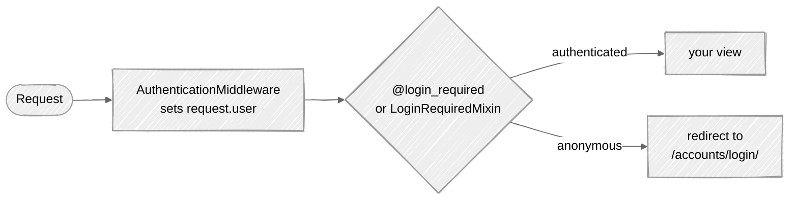

# Week 09: Authentication & Authorization

## 🎯 Learning Objectives

- Implement user registration and login
- Use Django's authentication system
- Create custom user models
- Handle permissions and groups
- Protect views with decorators and mixins

How a request reaches (or doesn't reach) a protected view:



## 📚 Required Reading

| Resource                                                                                                | Section   | Time   |
| ------------------------------------------------------------------------------------------------------- | --------- | ------ |
| [Authentication](https://docs.djangoproject.com/en/5.0/topics/auth/)                                    | Full page | 45 min |
| [Custom User Model](https://docs.djangoproject.com/en/5.0/topics/auth/customizing/)                     | Full page | 30 min |
| [Permissions](https://docs.djangoproject.com/en/5.0/topics/auth/default/#permissions-and-authorization) | Full page | 20 min |

---

## Key Concepts

### Custom User Model (Always do this first!)

> ⚠️ **Critical**: A custom user model **must** be set up *before* you run any migrations
> on your database. If you have already run `migrate` with the default `auth.User`, the
> safest fix is to delete your `db.sqlite3` and any auto-generated migrations in `tasks/migrations/`
> (keep `__init__.py`) and re-run the steps below from scratch.

#### Step 1: Create the `accounts` app

From the `taskmaster/` project root:

```bash
uv run python manage.py startapp accounts
```

This creates the `accounts/` directory (with its required `__init__.py`, `apps.py`, etc.).
Without this command, `import accounts` will fail with `ModuleNotFoundError: No module named 'accounts'`
later on (in testing, fixtures, factories, etc.).

#### Step 2: Register the app and tell Django to use the custom user

```python
# config/settings.py
INSTALLED_APPS = [
    # ... default apps ...
    'tasks',
    'accounts',  # ← add this
]

AUTH_USER_MODEL = 'accounts.User'  # ← add this line BEFORE you run migrate
```

#### Step 3: Define the custom user

```python
# accounts/models.py
from django.contrib.auth.models import AbstractUser
from django.db import models


class User(AbstractUser):
    """Custom user model - extend as needed."""
    bio = models.TextField(blank=True)
    avatar = models.ImageField(upload_to='avatars/', blank=True)

    def __str__(self):
        return self.email or self.username
```

#### Step 4: Create and apply migrations

```bash
uv run python manage.py makemigrations accounts
uv run python manage.py migrate
```

### Authentication Views

```python
# accounts/views.py
from django.contrib.auth import get_user_model, login
from django.contrib.auth.decorators import login_required
from django.contrib.auth.forms import UserCreationForm
from django.shortcuts import redirect, render


class CustomUserCreationForm(UserCreationForm):
    # UserCreationForm.Meta.model is hard-coded to auth.User, which is
    # swapped out once AUTH_USER_MODEL is set — using it as-is raises
    # "Manager isn't available; 'auth.User' has been swapped". Override.
    class Meta(UserCreationForm.Meta):
        model = get_user_model()


def register(request):
    if request.method == 'POST':
        form = CustomUserCreationForm(request.POST)
        if form.is_valid():
            user = form.save()
            login(request, user)
            return redirect('accounts:profile')
    else:
        form = CustomUserCreationForm()
    return render(request, 'accounts/register.html', {'form': form})


@login_required
def profile(request):
    return render(request, 'accounts/profile.html')
```

```python
# accounts/urls.py
from django.urls import path, reverse_lazy
from django.contrib.auth import views as auth_views
from . import views

app_name = 'accounts'

urlpatterns = [
    path('login/', auth_views.LoginView.as_view(template_name='accounts/login.html'), name='login'),
    path('logout/', auth_views.LogoutView.as_view(), name='logout'),
    path('register/', views.register, name='register'),
    path('profile/', views.profile, name='profile'),

    # Password reset — because we're inside `app_name = 'accounts'`, the
    # default URL names (`password_reset_done`, `password_reset_complete`)
    # get prefixed to `accounts:password_reset_done` etc. The built-in views
    # default `success_url` to the *unnamespaced* name, so we must override
    # `success_url` explicitly or the redirect lookup fails.
    path(
        'password-reset/',
        auth_views.PasswordResetView.as_view(
            success_url=reverse_lazy('accounts:password_reset_done'),
        ),
        name='password_reset',
    ),
    path('password-reset/done/', auth_views.PasswordResetDoneView.as_view(), name='password_reset_done'),
    path(
        'reset/<uidb64>/<token>/',
        auth_views.PasswordResetConfirmView.as_view(
            success_url=reverse_lazy('accounts:password_reset_complete'),
        ),
        name='password_reset_confirm',
    ),
    path('reset/done/', auth_views.PasswordResetCompleteView.as_view(), name='password_reset_complete'),
]
```

Wire `accounts/urls.py` into the project urls:

```python
# config/urls.py
from django.urls import include, path

urlpatterns = [
    # ... existing patterns ...
    path('accounts/', include('accounts.urls')),
]
```

### Templates

The views and `LoginView`/`PasswordResetView` above render templates under
`accounts/`. Create them now so visiting `/accounts/login/`, `/accounts/register/`,
or `/accounts/profile/` doesn't raise `TemplateDoesNotExist`. These extend the
`base.html` you built in Week 06.

```bash
mkdir -p accounts/templates/accounts
```

```html
<!-- accounts/templates/accounts/login.html -->

Log in

  <h1>Log in</h1>
  <form method="post">
    
    {{ form.as_p }}
    <button type="submit">Log in</button>
  </form>
  <p>Need an account? <a href="">Register</a></p>

```

```html
<!-- accounts/templates/accounts/register.html -->

Register

  <h1>Create an account</h1>
  <form method="post">
    
    {{ form.as_p }}
    <button type="submit">Register</button>
  </form>
  <p>Already have an account? <a href="">Log in</a></p>

```

```html
<!-- accounts/templates/accounts/profile.html -->

Profile

  <h1>Hello, {{ user.username }}</h1>
  <p>Email: {{ user.email|default:"(not set)" }}</p>
  <form method="post" action="">
    
    <button type="submit">Log out</button>
  </form>

```

### Protecting Views

```python
# Function-based views
from django.contrib.auth.decorators import login_required, permission_required

@login_required
def profile(request):
    return render(request, 'accounts/profile.html')

@permission_required('tasks.add_task')
def task_create(request):
    ...

# Class-based views
from django.contrib.auth.mixins import LoginRequiredMixin, PermissionRequiredMixin

class TaskCreateView(LoginRequiredMixin, CreateView):
    model = Task
    ...

class TaskDeleteView(PermissionRequiredMixin, DeleteView):
    model = Task
    permission_required = 'tasks.delete_task'
```

### User-Specific Data

You're about to add a `ForeignKey` to a model that already has rows (the tasks from Week 04). A naive `models.ForeignKey(..., on_delete=CASCADE)` is **non-null** — `migrate` will fail or prompt for a one-off default that assigns every existing task to a single user (wrong).

There are three correct ways to do this. **Pick one** and follow it through:

**Option A — fresh start (simplest if you're solo).** Wipe the dev database and re-seed:

```bash
rm db.sqlite3
rm -rf tasks/migrations
python manage.py makemigrations tasks   # generates a clean 0001 with owner included
python manage.py migrate
python manage.py createsuperuser
```

**Option B — nullable first, then a data migration.** Production-safe pattern:

```python
# Step 1: nullable FK
class Task(models.Model):
    owner = models.ForeignKey(
        settings.AUTH_USER_MODEL,
        on_delete=models.CASCADE,
        related_name='tasks',
        null=True,             # ← key: nullable for the migration step
        blank=True,
    )
    ...
```

Generate the migration, then create a data migration to backfill:

```bash
python manage.py makemigrations tasks
python manage.py makemigrations --empty tasks --name backfill_task_owners
```

In `tasks/migrations/0003_backfill_task_owners.py`:

```python
from django.db import migrations
from django.conf import settings

def assign_owners(apps, schema_editor):
    User = apps.get_model(settings.AUTH_USER_MODEL.split('.', 1))
    Task = apps.get_model('tasks', 'Task')
    superuser = User.objects.filter(is_superuser=True).first()
    if superuser:
        Task.objects.filter(owner__isnull=True).update(owner=superuser)

class Migration(migrations.Migration):
    dependencies = [('tasks', '0002_task_owner')]
    operations = [migrations.RunPython(assign_owners, migrations.RunPython.noop)]
```

Then a third migration flips `null=False`:

```python
class Task(models.Model):
    owner = models.ForeignKey(
        settings.AUTH_USER_MODEL,
        on_delete=models.CASCADE,
        related_name='tasks',
    )   # null=True removed
```

**Option C — accept the one-off default during migrate**: when Django prompts you, pick option `1` and supply `1` (the superuser's PK). Only do this if you're certain the dev DB has one superuser and you don't care about the existing tasks.

Once `owner` is in place, the view code is:

```python
# Filter by user in views
class TaskListView(LoginRequiredMixin, ListView):
    def get_queryset(self):
        return Task.objects.filter(owner=self.request.user)

    def form_valid(self, form):
        form.instance.owner = self.request.user
        return super().form_valid(form)
```

---

## 📋 Submission Checklist

- [ ] Custom User model created
- [ ] Registration and login working
- [ ] Views protected with login_required
- [ ] Tasks filtered by owner
- [ ] Logout functionality
- [ ] Profile page

---

**Next**: [Week 10: REST API →](../week-10-rest-api/readme.md)
