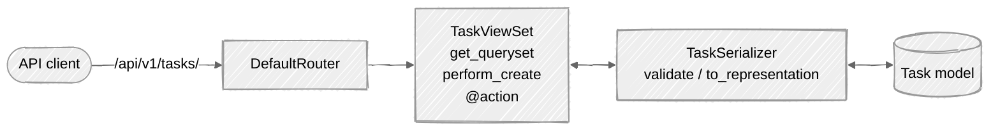

# Week 10: Django REST Framework

## 🎯 Learning Objectives

- Build RESTful APIs with Django REST Framework (DRF)
- Create serializers for your models
- Implement viewsets and routers
- Handle authentication and permissions
- Document your API

The DRF stack you'll wire up - a router exposes a ViewSet, which delegates serialization to a Serializer, which talks to the model:



## 📚 Required Reading

| Resource                                                                    | Section   | Time   |
| --------------------------------------------------------------------------- | --------- | ------ |
| [DRF Tutorial](https://www.django-rest-framework.org/tutorial/quickstart/)  | All parts | 60 min |
| [Serializers](https://www.django-rest-framework.org/api-guide/serializers/) | Full page | 30 min |
| [ViewSets](https://www.django-rest-framework.org/api-guide/viewsets/)       | Full page | 20 min |

---

## Setup

```bash
uv add djangorestframework
```

```python
# config/settings.py
INSTALLED_APPS = [
    ...
    'rest_framework',
    'rest_framework.authtoken',   # required for TokenAuthentication
]

REST_FRAMEWORK = {
    'DEFAULT_PERMISSION_CLASSES': [
        'rest_framework.permissions.IsAuthenticated',
    ],
    'DEFAULT_AUTHENTICATION_CLASSES': [
        'rest_framework.authentication.SessionAuthentication',
        'rest_framework.authentication.TokenAuthentication',
    ],
    'DEFAULT_PAGINATION_CLASS': 'rest_framework.pagination.PageNumberPagination',
    'PAGE_SIZE': 20,
    # Throttle anonymous + authenticated traffic. Without this, a single
    # script can drain your DB. Adjust rates to your traffic profile.
    'DEFAULT_THROTTLE_CLASSES': [
        'rest_framework.throttling.AnonRateThrottle',
        'rest_framework.throttling.UserRateThrottle',
    ],
    'DEFAULT_THROTTLE_RATES': {
        'anon': '60/min',
        'user': '600/min',
    },
}
```

### CORS (browser frontends only)

If your API is called from a browser at a different origin (a separate React/Vue/Svelte app), install and configure CORS:

```bash
uv add django-cors-headers
```

```python
INSTALLED_APPS += ['corsheaders']
MIDDLEWARE = [
    'corsheaders.middleware.CorsMiddleware',   # high in the list
    *MIDDLEWARE,
]
CORS_ALLOWED_ORIGINS = [
    'http://localhost:5173',         # Vite dev server
    'https://app.taskmaster.com',    # your prod frontend
]
CORS_ALLOW_CREDENTIALS = True   # if session cookies cross the origin
```

> ⚠️ **`CORS_ALLOW_ALL_ORIGINS = True` plus `CORS_ALLOW_CREDENTIALS = True` is a security bug.** Pick explicit allowed origins or pick the no-credentials path. See [appsec-mentorship week 9](https://github.com/ichdamola/appsec-mentorship/tree/main/week-09-csrf-cors-sop) for the deeper version.

### Token endpoint

The `authtoken` migration creates the storage table; you also need an endpoint that mints tokens for users:

```python
# config/urls.py
from rest_framework.authtoken.views import obtain_auth_token
urlpatterns += [
    path('api/v1/auth/token/', obtain_auth_token),
]
```

Then `POST /api/v1/auth/token/` with `{"username": ..., "password": ...}` returns `{"token": "..."}`. Send it on subsequent requests as `Authorization: Token <value>`.

Note: DRF's built-in tokens never expire. For real apps consider **`djangorestframework-simplejwt`** (JWTs with refresh tokens) or **`dj-rest-auth`** (a full auth API package).

After installing `'rest_framework.authtoken'`, run migrations so the `authtoken_token` table exists:

```bash
python manage.py migrate
```

Without those two steps, every request that tries to authenticate by token will silently fail (the lookup against the missing table raises and DRF falls through to anonymous).

---

## Key Concepts

### Serializers

```python
# tasks/serializers.py
from rest_framework import serializers
from .models import Task, Category, Tag


class TagSerializer(serializers.ModelSerializer):
    class Meta:
        model = Tag
        fields = ['id', 'name']


class CategorySerializer(serializers.ModelSerializer):
    task_count = serializers.IntegerField(read_only=True)

    class Meta:
        model = Category
        fields = ['id', 'name', 'description', 'color', 'task_count']


class TaskSerializer(serializers.ModelSerializer):
    category = CategorySerializer(read_only=True)
    # category_id and tag_ids need a per-request queryset so users can't
    # attach another user's Category/Tag (IDOR). Default behavior of
    # `queryset=Category.objects.all()` would allow it. The
    # get_fields() override below scopes the FK to the requesting user.
    category_id = serializers.PrimaryKeyRelatedField(
        queryset=Category.objects.none(),    # ← real queryset set in get_fields()
        source='category',
        write_only=True,
        required=False
    )
    tags = TagSerializer(many=True, read_only=True)
    tag_ids = serializers.PrimaryKeyRelatedField(
        queryset=Tag.objects.none(),
        source='tags',
        write_only=True,
        many=True,
        required=False
    )
    is_overdue = serializers.BooleanField(read_only=True)
    owner = serializers.StringRelatedField(read_only=True)

    class Meta:
        model = Task
        fields = [
            'id', 'title', 'description', 'priority', 'status',
            'category', 'category_id', 'tags', 'tag_ids',
            'due_date', 'is_overdue', 'owner',
            'created_at', 'updated_at'
        ]
        read_only_fields = ['created_at', 'updated_at']

    def get_fields(self):
        fields = super().get_fields()
        request = self.context.get('request')
        if request and request.user.is_authenticated:
            fields['category_id'].queryset = Category.objects.filter(owner=request.user)
            fields['tag_ids'].queryset = Tag.objects.filter(owner=request.user)
        return fields
```

### ViewSets

```python
# tasks/views_api.py
from rest_framework import viewsets, permissions, status
from rest_framework.decorators import action
from rest_framework.response import Response
from django.db.models import Count

from .models import Task, Category, Tag
from .serializers import TaskSerializer, CategorySerializer, TagSerializer


class TaskViewSet(viewsets.ModelViewSet):
    serializer_class = TaskSerializer
    permission_classes = [permissions.IsAuthenticated]

    def get_queryset(self):
        return Task.objects.filter(
            owner=self.request.user
        ).select_related('category').prefetch_related('tags')

    def perform_create(self, serializer):
        serializer.save(owner=self.request.user)

    @action(detail=True, methods=['post'])
    def complete(self, request, pk=None):
        task = self.get_object()
        task.mark_complete()
        return Response({'status': 'completed'})

    @action(detail=False, methods=['get'])
    def stats(self, request):
        queryset = self.get_queryset()
        return Response({
            'total': queryset.count(),
            'completed': queryset.filter(status='completed').count(),
            'pending': queryset.filter(status='pending').count(),
        })


class CategoryViewSet(viewsets.ModelViewSet):
    """Owner-scoped - a user only sees / writes / deletes their OWN categories."""
    serializer_class = CategorySerializer
    permission_classes = [permissions.IsAuthenticated]

    def get_queryset(self):
        # Scope to the requesting user. Without this any authenticated user
        # can read, modify, or delete anyone's categories (IDOR).
        return Category.objects.filter(
            owner=self.request.user
        ).annotate(task_count=Count('tasks'))

    def perform_create(self, serializer):
        serializer.save(owner=self.request.user)


class TagViewSet(viewsets.ModelViewSet):
    """Owner-scoped - same rationale as CategoryViewSet."""
    serializer_class = TagSerializer
    permission_classes = [permissions.IsAuthenticated]

    def get_queryset(self):
        return Tag.objects.filter(owner=self.request.user)

    def perform_create(self, serializer):
        serializer.save(owner=self.request.user)
```

> 📝 **Requires `Category.owner` and `Tag.owner` fields.** Week 04 introduced
> `Category` and `Tag` as shared dimension tables. To owner-scope them you'd
> add a `models.ForeignKey(settings.AUTH_USER_MODEL, on_delete=models.CASCADE)`
> column on each (same migration pattern as Week 09's `Task.owner`). If you
> intentionally want shared categories/tags (a multi-tenant team-scoped
> taxonomy), make these viewsets `ReadOnlyModelViewSet` and lock writes to
> `IsAdminUser` - anything in between leaks data across users.

### URL Routing

```python
# tasks/urls_api.py
from rest_framework.routers import DefaultRouter
from . import views_api

router = DefaultRouter()
router.register('tasks', views_api.TaskViewSet, basename='task')
router.register('categories', views_api.CategoryViewSet, basename='category')
router.register('tags', views_api.TagViewSet, basename='tag')

urlpatterns = router.urls

# config/urls.py
urlpatterns = [
    ...
    path('api/v1/', include('tasks.urls_api')),
]
```

### API versioning

The `/api/v1/` prefix above is **URL path versioning** - the simplest scheme. When you ship a v2, mount a separate URL conf:

```python
path('api/v1/', include('tasks.urls_api')),
path('api/v2/', include('tasks.urls_api_v2')),
```

Both versions stay live until v1 consumers migrate. DRF also supports header-based versioning (`AcceptHeaderVersioning`) and namespace versioning - see DRF's [versioning docs](https://www.django-rest-framework.org/api-guide/versioning/) for when each fits.

### API Endpoints

| Endpoint                       | Method    | Description    |
| ------------------------------ | --------- | -------------- |
| `/api/v1/tasks/`               | GET       | List all tasks |
| `/api/v1/tasks/`               | POST      | Create task    |
| `/api/v1/tasks/{id}/`          | GET       | Get task       |
| `/api/v1/tasks/{id}/`          | PUT/PATCH | Update task    |
| `/api/v1/tasks/{id}/`          | DELETE    | Delete task    |
| `/api/v1/tasks/{id}/complete/` | POST      | Mark complete  |
| `/api/v1/tasks/stats/`         | GET       | Get statistics |

---

## 📋 Submission Checklist

- [ ] DRF installed and configured
- [ ] Serializers for all models
- [ ] ViewSets with CRUD operations
- [ ] Custom actions (complete, stats)
- [ ] API authentication working
- [ ] API documentation viewable at `/api/v1/`

---

**Next**: [Week 11: Testing →](../week-11-testing/readme.md)
