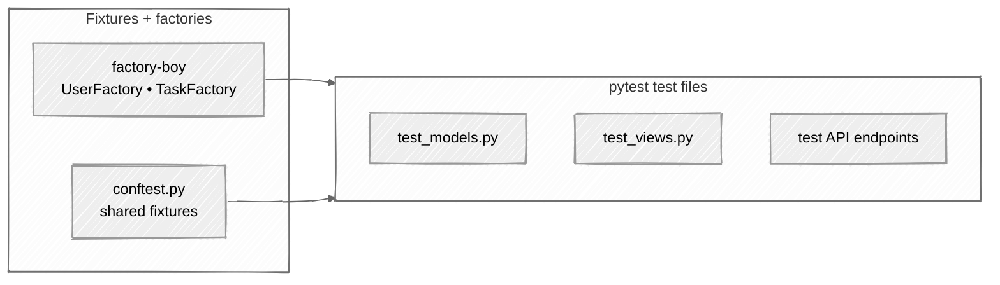

# Week 11: Testing Django Applications

## 🎯 Learning Objectives

- Write unit tests with pytest
- Use fixtures for test data
- Test models, views, and forms
- Mock external dependencies
- Achieve high test coverage

The testing setup you'll build — factories generate test data, conftest exposes fixtures, and each test file covers one layer:



## 📚 Required Reading

| Resource                                                                | Section         | Time   |
| ----------------------------------------------------------------------- | --------------- | ------ |
| [Django Testing](https://docs.djangoproject.com/en/5.0/topics/testing/) | Full page       | 45 min |
| [pytest-django](https://pytest-django.readthedocs.io/)                  | Getting started | 30 min |
| [Factory Boy](https://factoryboy.readthedocs.io/)                       | Tutorial        | 20 min |

---

## Setup

```bash
uv add --dev pytest pytest-django pytest-cov factory-boy
```

```python
# pyproject.toml
[tool.pytest.ini_options]
DJANGO_SETTINGS_MODULE = "config.settings"
python_files = ["test_*.py", "*_test.py"]
addopts = "-v --tb=short"

[tool.coverage.run]
source = ["tasks"]
omit = ["*/migrations/*", "*/tests/*"]
```

### Test package layout

Tests live inside each app under a `tests/` Python **package**. Create the empty
`__init__.py` files first or Python won't be able to import them:

```bash
mkdir -p tasks/tests accounts/tests
touch tasks/tests/__init__.py accounts/tests/__init__.py
```

The final layout you should have at the end of this week:

```
taskmaster/
├── conftest.py                    ← project-root fixtures (see "Fixtures" below)
├── pyproject.toml
├── config/
├── accounts/
│   ├── __init__.py
│   ├── models.py                  ← from Week 09
│   └── tests/
│       ├── __init__.py
│       └── factories.py           ← UserFactory lives here
└── tasks/
    ├── __init__.py
    ├── models.py
    └── tests/
        ├── __init__.py
        ├── factories.py           ← TaskFactory, CategoryFactory, TagFactory
        ├── test_models.py
        └── test_views.py
```

> 💡 **Why two `factories.py` files?** Factories belong with the app whose models
> they create. `UserFactory` lives in `accounts/` because it builds users;
> `TaskFactory` lives in `tasks/` because it builds tasks. Cross-app references use
> the string form (`'accounts.tests.factories.UserFactory'`) to avoid import cycles.

---

## Key Concepts

### Factories

```python
# accounts/tests/factories.py
import factory
from django.contrib.auth import get_user_model
from factory.django import DjangoModelFactory


class UserFactory(DjangoModelFactory):
    class Meta:
        model = get_user_model()
        django_get_or_create = ('username',)

    username = factory.Sequence(lambda n: f'user{n}')
    email = factory.LazyAttribute(lambda obj: f'{obj.username}@example.com')

    # `PostGenerationMethodCall('set_password', ...)` hashes the password on
    # the instance AFTER save, so the in-memory object has it but the DB row
    # doesn't. client.login() then fails because the DB has whatever Django
    # auto-set. Use @post_generation + save() to persist.
    @factory.post_generation
    def password(obj, create, extracted, **kwargs):
        if not create:
            return
        raw = extracted or 'password123'
        obj.set_password(raw)
        obj.save()
        # Stash the raw password on the instance so tests can use it.
        obj._raw_password = raw
```

`get_user_model()` is used instead of importing `accounts.models.User` directly so
this file keeps working even if you later swap the user model.

```python
# tasks/tests/factories.py
import factory
from factory.django import DjangoModelFactory
from tasks.models import Task, Category, Tag, Priority, Status


class CategoryFactory(DjangoModelFactory):
    class Meta:
        model = Category

    name = factory.Sequence(lambda n: f'Category {n}')
    description = factory.Faker('text', max_nb_chars=200)
    color = factory.Faker('hex_color')


class TagFactory(DjangoModelFactory):
    class Meta:
        model = Tag

    name = factory.Sequence(lambda n: f'tag-{n}')


class TaskFactory(DjangoModelFactory):
    class Meta:
        model = Task

    title = factory.Faker('sentence', nb_words=4)
    description = factory.Faker('paragraph')
    priority = Priority.MEDIUM
    status = Status.PENDING
    category = factory.SubFactory(CategoryFactory)
    owner = factory.SubFactory('accounts.tests.factories.UserFactory')

    @factory.post_generation
    def tags(self, create, extracted, **kwargs):
        if not create:
            return
        if extracted:
            for tag in extracted:
                self.tags.add(tag)
```

### Model Tests

```python
# tasks/tests/test_models.py
import pytest
from django.utils import timezone
from datetime import timedelta

from tasks.models import Task, Status
from .factories import TaskFactory, CategoryFactory


@pytest.mark.django_db
class TestTaskModel:
    def test_create_task(self):
        task = TaskFactory()
        assert task.pk is not None
        assert task.status == Status.PENDING

    def test_mark_complete(self):
        task = TaskFactory(status=Status.PENDING)
        task.mark_complete()

        assert task.status == Status.COMPLETED
        assert task.completed_at is not None

    def test_is_overdue_when_past_due(self):
        task = TaskFactory(
            due_date=timezone.now().date() - timedelta(days=1),
            status=Status.PENDING
        )
        assert task.is_overdue is True

    def test_is_not_overdue_when_completed(self):
        task = TaskFactory(
            due_date=timezone.now().date() - timedelta(days=1),
            status=Status.COMPLETED
        )
        assert task.is_overdue is False

    def test_str_returns_title(self):
        task = TaskFactory(title="Test Task")
        assert str(task) == "Test Task"
```

### View Tests

```python
# tasks/tests/test_views.py
import pytest
from django.urls import reverse
from rest_framework import status as http_status

from accounts.tests.factories import UserFactory
from .factories import TaskFactory


@pytest.mark.django_db
class TestTaskListView:
    def test_list_requires_auth(self, client):
        """
        Pre-req: `task_list` must be auth-protected (added in Week 09).
        If you haven't done that step yet, either retrofit it now:

            # tasks/views.py
            from django.contrib.auth.mixins import LoginRequiredMixin
            class TaskListView(LoginRequiredMixin, ListView):
                ...

        Or, for FBV-style views:
            @login_required
            def task_list(request): ...
        """
        url = reverse('tasks:task_list')
        response = client.get(url)

        # Use assertRedirects so the assertion catches both /login/ and
        # /accounts/login/?next=... configurations.
        from django.contrib.auth import REDIRECT_FIELD_NAME
        assert response.status_code == 302
        assert REDIRECT_FIELD_NAME in response.url   # '?next=' is present
        assert 'login' in response.url.lower()

    def test_list_shows_user_tasks_only(self, client):
        user = UserFactory()
        other_user = UserFactory()

        my_task = TaskFactory(owner=user, title="My Task")
        other_task = TaskFactory(owner=other_user, title="Other Task")

        client.force_login(user)
        response = client.get(reverse('tasks:task_list'))

        assert response.status_code == 200
        assert "My Task" in response.content.decode()
        assert "Other Task" not in response.content.decode()


@pytest.mark.django_db
class TestTaskAPI:
    def test_create_task(self, api_client, user):
        api_client.force_authenticate(user)

        data = {
            'title': 'New Task',
            'description': 'Task description',
            'priority': 2,
        }

        response = api_client.post('/api/v1/tasks/', data)

        assert response.status_code == http_status.HTTP_201_CREATED
        assert response.data['title'] == 'New Task'
        assert response.data['owner'] == str(user)
```

### Fixtures

`conftest.py` goes at the **project root** (next to `manage.py` and `pyproject.toml`),
not inside `tasks/tests/`. Putting it at the root makes the fixtures below available
to every test file in every app.

```python
# conftest.py  ← project root, NOT tasks/tests/conftest.py
import pytest
from rest_framework.test import APIClient

from accounts.tests.factories import UserFactory


@pytest.fixture
def user():
    return UserFactory()


@pytest.fixture
def api_client():
    return APIClient()


@pytest.fixture
def authenticated_client(client, user):
    client.force_login(user)
    return client
```

### Form Tests

```python
# tasks/tests/test_forms.py
import pytest
from tasks.forms import TaskForm

@pytest.mark.django_db
def test_clean_title_rejects_short_titles():
    form = TaskForm(data={'title': 'no', 'priority': 2, 'status': 'pending'})
    assert not form.is_valid()
    assert 'title' in form.errors

@pytest.mark.django_db
def test_clean_rejects_completed_with_future_due_date():
    from datetime import date, timedelta
    form = TaskForm(data={
        'title': 'finish report', 'priority': 2,
        'status': 'completed',
        'due_date': date.today() + timedelta(days=7),
    })
    assert not form.is_valid()
    assert form.errors.get('__all__')   # non-field error from clean()
```

### Serializer Tests

```python
# tasks/tests/test_api_serializers.py
import pytest
from tasks.serializers import TaskSerializer

@pytest.mark.django_db
def test_serializer_rejects_other_users_category(user, other_user, category_factory):
    other_cat = category_factory(owner=other_user)
    request = type('Req', (), {'user': user})()
    serializer = TaskSerializer(
        data={'title': 't', 'category_id': other_cat.pk, 'priority': 2},
        context={'request': request},
    )
    assert not serializer.is_valid()
    assert 'category_id' in serializer.errors
```

### Admin action / Celery Tests

```python
# tasks/tests/test_celery.py
import pytest
from tasks.tasks import send_task_reminder

@pytest.mark.django_db
def test_send_task_reminder_skips_users_without_email(task_factory, user_factory):
    user = user_factory(email='')
    task = task_factory(owner=user)
    result = send_task_reminder(task.pk)    # runs eagerly when CELERY_TASK_ALWAYS_EAGER=True
    assert 'no email on file' in result
```

```python
# conftest.py — set eager mode for all tests
@pytest.fixture(autouse=True)
def _celery_eager(settings):
    settings.CELERY_TASK_ALWAYS_EAGER = True
    settings.CELERY_TASK_EAGER_PROPAGATES = True
```

### Running Tests

```bash
# Run all tests
uv run pytest

# Run with coverage
uv run pytest --cov=tasks --cov-report=html

# Run specific test file
uv run pytest tasks/tests/test_models.py

# Run specific test
uv run pytest tasks/tests/test_models.py::TestTaskModel::test_mark_complete

# Verbose output
uv run pytest -v
```

---

## 📋 Submission Checklist

- [ ] pytest configured
- [ ] Factories for all models
- [ ] Model tests (CRUD, methods, properties)
- [ ] View tests (permissions, rendering)
- [ ] API tests (all endpoints)
- [ ] 80%+ test coverage

---

**Next**: [Week 12: Advanced ORM →](../week-12-advanced-orm/readme.md)
