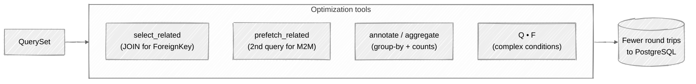

# Week 12: Advanced ORM Techniques

## 🎯 Learning Objectives

- Optimize queries with select_related and prefetch_related
- Use aggregations and annotations
- Write complex queries with Q and F objects
- Implement raw SQL when needed
- Profile and debug database queries

The QuerySet optimization toolbox you'll reach for, and what each tool fixes:



## 📚 Required Reading

| Resource                                                                            | Section        | Time   |
| ----------------------------------------------------------------------------------- | -------------- | ------ |
| [QuerySet API](https://docs.djangoproject.com/en/5.0/ref/models/querysets/)         | Full reference | 60 min |
| [Aggregation](https://docs.djangoproject.com/en/5.0/topics/db/aggregation/)         | Full page      | 30 min |
| [Query Optimization](https://docs.djangoproject.com/en/5.0/topics/db/optimization/) | Full page      | 30 min |

---

## Key Concepts

### Query Optimization

```python
# BAD: N+1 query problem
tasks = Task.objects.all()
for task in tasks:
    print(task.category.name)  # Each access hits database!

# GOOD: select_related for ForeignKey
tasks = Task.objects.select_related('category').all()
for task in tasks:
    print(task.category.name)  # No additional queries!

# GOOD: prefetch_related for ManyToMany
tasks = Task.objects.prefetch_related('tags').all()
for task in tasks:
    print([t.name for t in task.tags.all()])  # Already fetched!

# Combined
tasks = Task.objects.select_related('category', 'owner').prefetch_related('tags')
```

### Aggregations

```python
from django.db.models import Count, Avg, Sum, Max, Min, Q, F

# Basic aggregation
Task.objects.aggregate(
    total=Count('id'),
    avg_priority=Avg('priority'),
)

# Conditional aggregation
Task.objects.aggregate(
    total=Count('id'),
    completed=Count('id', filter=Q(status='completed')),
    high_priority=Count('id', filter=Q(priority__gte=3)),
)

# Group by with annotation
Category.objects.annotate(
    task_count=Count('tasks'),
    completed_count=Count('tasks', filter=Q(tasks__status='completed')),
).values('name', 'task_count', 'completed_count')

# Computed fields - backend-aware: on Postgres `F('due_date') - timezone.now().date()`
# returns an `interval`; on SQLite the result is a string and __lte=7 doesn't
# work as expected. For portable code, wrap in ExpressionWrapper with an
# explicit output_field:
from django.db.models import DurationField, ExpressionWrapper
from datetime import timedelta

Task.objects.annotate(
    days_until_due=ExpressionWrapper(
        F('due_date') - timezone.now().date(),
        output_field=DurationField(),
    )
).filter(days_until_due__lte=timedelta(days=7))
```

### Complex Queries

```python
from django.db.models import Q, F, Case, When, Value
from django.utils import timezone

# OR conditions - "high priority OR overdue (derived, not a stored status)"
# `Status` only has PENDING/IN_PROGRESS/COMPLETED/CANCELLED - "overdue" is a
# computed condition, not a stored value. This is a more honest demonstration
# of why Q exists in the first place.
Task.objects.filter(
    Q(priority=Priority.HIGH)
    | (Q(due_date__lt=timezone.now().date()) & ~Q(status=Status.COMPLETED))
)

# NOT conditions
Task.objects.filter(~Q(status=Status.COMPLETED))

# Dynamic filtering
def search_tasks(query=None, status=None, category=None):
    filters = Q()
    if query:
        filters &= Q(title__icontains=query) | Q(description__icontains=query)
    if status:
        filters &= Q(status=status)
    if category:
        filters &= Q(category_id=category)
    return Task.objects.filter(filters)

# Conditional expressions
Task.objects.annotate(
    priority_label=Case(
        When(priority=1, then=Value('Low')),
        When(priority=2, then=Value('Medium')),
        When(priority=3, then=Value('High')),
        default=Value('Unknown'),
    )
)

# Subqueries
from django.db.models import Subquery, OuterRef

latest_task = Task.objects.filter(
    category=OuterRef('pk')
).order_by('-created_at')

Category.objects.annotate(
    latest_task_title=Subquery(latest_task.values('title')[:1])
)
```

### Query Debugging

```python
# Print SQL
print(Task.objects.filter(status='pending').query)

# Django Debug Toolbar (install in dev)
# uv add --dev django-debug-toolbar

# Query counting in tests
from django.test.utils import CaptureQueriesContext
from django.db import connection

with CaptureQueriesContext(connection) as context:
    list(Task.objects.select_related('category').all())

print(f"Number of queries: {len(context)}")
for query in context:
    print(query['sql'])
```

### Raw SQL

```python
# Raw queryset (returns model instances)
Task.objects.raw('''
    SELECT * FROM tasks_task
    WHERE priority >= %s
    ORDER BY created_at DESC
''', [3])

# Direct cursor (for complex queries)
from django.db import connection

with connection.cursor() as cursor:
    cursor.execute('''
        SELECT category_id, COUNT(*) as count
        FROM tasks_task
        GROUP BY category_id
    ''')
    results = cursor.fetchall()
```

---

## Part 2: N+1 lab - find and fix one yourself

Spin up Django Debug Toolbar and **see** the N+1 in action. Without this exercise the lesson stays abstract.

### Step 1: install

```bash
uv add --dev django-debug-toolbar
```

```python
# config/settings.py (or dev.py)
INSTALLED_APPS += ['debug_toolbar']
MIDDLEWARE = ['debug_toolbar.middleware.DebugToolbarMiddleware', *MIDDLEWARE]
INTERNAL_IPS = ['127.0.0.1']
```

```python
# config/urls.py
if settings.DEBUG:
    urlpatterns += [path('__debug__/', include('debug_toolbar.urls'))]
```

### Step 2: write a deliberately bad list view

```python
# tasks/views.py
class TaskListView(ListView):
    model = Task
    template_name = 'tasks/task_list.html'
    context_object_name = 'tasks'

    def get_queryset(self):
        return Task.objects.all()    # ← deliberately naive
```

```html
{# tasks/templates/tasks/task_list.html #}

    <li>
        {{ task.title }} - {{ task.category.name }} -
        {{ tag.name }} 
    </li>

```

Visit `/tasks/list/` with the toolbar panel open. Click **SQL**. With 50 tasks each in a different category and 3 tags, you'll see:

- 1 query for the tasks
- 50 queries for each category lookup (`task.category.name`)
- 50 queries for each task's tags

**101 queries to render one page.**

### Step 3: fix it

```python
    def get_queryset(self):
        return Task.objects.select_related('category').prefetch_related('tags')
```

Reload. SQL panel now shows **3 queries total**:

1. The task list
2. The category JOIN (via `select_related`)
3. A second query that fetches all tags for all those tasks (via `prefetch_related`)

That's the win you're learning to chase on every list view, every admin page, every API endpoint.

### Step 4: prove it stays fixed with `assertNumQueries`

```python
# tasks/tests/test_performance.py
import pytest
from django.urls import reverse
from .factories import TaskFactory

@pytest.mark.django_db
def test_task_list_view_query_count(client, django_assert_num_queries):
    TaskFactory.create_batch(50)
    # 2 queries: 1 for tasks (with category JOIN via select_related)
    #            + 1 for tags (prefetch_related fires a second SELECT).
    # If your view triggers session/auth queries (e.g., @login_required
    # backed by SessionMiddleware), add those. Run once with
    # django_assert_num_queries(0) to see the actual count in the failure
    # message, then lock that number in.
    with django_assert_num_queries(2):
        response = client.get(reverse('tasks:task_list'))
    assert response.status_code == 200
```

The exact count is the contract: future commits that regress to 50+ queries break the test loudly. This is how you keep N+1 from coming back six months later.

---

## Part 3: Subqueries with `Subquery` + `OuterRef`

When a value depends on a query *per row*, neither aggregation nor JOIN nor a Python loop is the right tool - `Subquery` is. The use case: "for each Category, show the title of its most recently created task."

```python
from django.db.models import Subquery, OuterRef

latest_task_title = (
    Task.objects
    .filter(category=OuterRef('pk'))    # OuterRef is "the Category being iterated"
    .order_by('-created_at')
    .values('title')[:1]                 # values() + slice limits to one column, one row
)

Category.objects.annotate(
    latest_title=Subquery(latest_task_title),
).values('name', 'latest_title')
```

The generated SQL is a correlated subquery - one query for the whole result set, not N. Common variant: count comparisons across queries:

```python
# "Categories whose latest task is overdue"
latest_due = (
    Task.objects
    .filter(category=OuterRef('pk'))
    .order_by('-created_at')
    .values('due_date')[:1]
)

Category.objects.annotate(
    latest_due_date=Subquery(latest_due),
).filter(latest_due_date__lt=timezone.now().date())
```

Use `Exists` for "any" / "none" subqueries - it's cheaper than `Subquery + count > 0`:

```python
from django.db.models import Exists

Category.objects.annotate(
    has_overdue=Exists(
        Task.objects.filter(
            category=OuterRef('pk'),
            due_date__lt=timezone.now().date(),
        ).exclude(status='completed')
    )
).filter(has_overdue=True)
```

---

## Part 4: Window functions

Django 2.0+ supports window functions for "rank within group," "running totals," "lag/lead" queries - things that previously required raw SQL.

```python
from django.db.models import Window, F
from django.db.models.functions import Rank, RowNumber, Lag

# "Rank tasks within each category by priority, highest first"
Task.objects.annotate(
    rank_in_category=Window(
        expression=Rank(),
        partition_by=[F('category')],
        order_by=F('priority').desc(),
    )
).values('title', 'category', 'priority', 'rank_in_category')
```

```python
# "For each task, what was the previous task in this category by created_at?"
Task.objects.annotate(
    prev_task=Window(
        expression=Lag('title'),
        partition_by=[F('category')],
        order_by=F('created_at').asc(),
    )
)
```

Window functions are expensive - they run after `WHERE` but before `LIMIT`, so a window over 1M rows is slow even if you only want the top 10. Combine with a CTE or a pre-filtered subquery.

---

## Part 5: Database functions

For string/date/math operations done at the DB layer instead of in Python:

```python
from django.db.models import F, Value
from django.db.models.functions import (
    Concat, Lower, Upper, Length, Coalesce, Cast,
    TruncDate, TruncMonth, ExtractYear, Greatest, Least, Now,
)

# Concat - build a full label in SQL
Task.objects.annotate(
    label=Concat('title', Value(' ('), 'status', Value(')')),
).values('label')

# Coalesce - first non-null
Task.objects.annotate(
    effective_due=Coalesce('due_date', Now()),
)

# TruncMonth - group by month
from django.db.models import Count
Task.objects.annotate(
    month=TruncMonth('created_at'),
).values('month').annotate(c=Count('id')).order_by('month')

# Length - index-friendly filter
Task.objects.annotate(title_len=Length('title')).filter(title_len__gt=50)
```

These run in the database, not Python. Critical for performance on large result sets - pulling 100k rows back to do `.lower()` in a Python loop is 1000× slower than a single `Lower()` annotation.

---

## Part 6: QuerySet evaluation - caching pitfalls

QuerySets are lazy. They evaluate (and cache) on:

- Iteration (`for t in qs`)
- `list(qs)` / `len(qs)`
- `bool(qs)` (truthiness check)
- Slicing with a step (`qs[::2]`)
- `repr(qs)` / `print(qs)`

Common bugs:

```python
qs = Task.objects.filter(status='pending')

# BUG: two queries - count() does not use the iteration cache
print(qs.count())   # SELECT COUNT(*) ...
print(len(qs))      # SELECT * ... + Python-side len

# FIX: pick one
qs = list(Task.objects.filter(status='pending'))
print(len(qs))      # already in memory

# BUG: refetched on every loop iteration
def category_count():
    return Category.objects.count()       # ← runs N times in a template loop

# FIX: pass the value into context
context['category_count'] = Category.objects.count()
```

And the **shared queryset cache gotcha** - slicing creates a *new* queryset that does NOT share the cache:

```python
qs = Task.objects.all()
list(qs)              # query 1, cached
qs[:10]               # query 2 - fresh, ignores the cache
list(qs[:10])         # query 3 even though qs is already fetched
```

For pagination, always re-slice at the boundary, never in a hot loop.

---

## Part 7: When to drop to raw SQL

The ORM covers 95% of cases. The remaining 5% is when raw SQL is the right answer:

| Use case | Raw or ORM? |
|---|---|
| Standard CRUD, joins, filters | ORM |
| Aggregations + grouping | ORM |
| Window functions | ORM (Django 2+) |
| CTEs (`WITH ... AS`) | Use [`django-cte`](https://github.com/dimagi/django-cte) or drop to raw |
| Database-specific features (Postgres `LATERAL JOIN`, `GIN` index hints) | Raw |
| Multi-table updates with cross-table conditions | Raw with `cursor.execute` |
| Bulk operations on millions of rows | Raw (bypass model instantiation entirely) |

Two safe entry points:

```python
# Raw queryset - returns model instances
for task in Task.objects.raw('SELECT * FROM tasks_task WHERE priority = %s', [3]):
    print(task.title)

# Cursor - for queries that don't map to a model
from django.db import connection
with connection.cursor() as cursor:
    cursor.execute('SELECT status, COUNT(*) FROM tasks_task GROUP BY status')
    for status, count in cursor.fetchall():
        print(status, count)
```

> ⚠️ **Always parameterize.** `cursor.execute('SELECT ... WHERE id = %s', [user_id])`, never f-strings or `%`-formatting. SQL injection is the same here as anywhere else - see [appsec-mentorship Week 05](https://github.com/ichdamola/appsec-mentorship/blob/main/week-05-sql-injection/attack.md).

---

## Part 8: `bulk_create` / `bulk_update` for large writes

A loop of `Model.objects.create(...)` issues one INSERT per row. For 10k rows, that's 10k round trips:

```python
# BAD - 10,000 round trips
for row in rows:
    Task.objects.create(title=row['title'], status='pending')

# GOOD - 1 query (or batches)
tasks = [Task(title=row['title'], status='pending') for row in rows]
Task.objects.bulk_create(tasks, batch_size=1000)
```

`bulk_update` is the same idea for changing existing rows:

```python
tasks_to_update = Task.objects.filter(status='pending')
for t in tasks_to_update:
    t.priority = 1
Task.objects.bulk_update(tasks_to_update, ['priority'], batch_size=1000)
```

Caveats: `bulk_create` does NOT call `save()` - no signals, no `auto_now` field updates, and you should not rely on `pre_save` / `post_save` firing. PKs are populated on Postgres, SQLite (3.35+), MariaDB, and Oracle via `RETURNING` (Django 4.0+ for SQLite, broader since then). MySQL still doesn't unless you fetch them back. Use `bulk_create` when you know you don't need signals.

---

## 📋 Submission Checklist

- [ ] Django Debug Toolbar installed; SQL panel screenshots in your notes
- [ ] One naive ListView profiled before/after `select_related` + `prefetch_related`
- [ ] `assertNumQueries` test on at least one list view (locks the count in)
- [ ] Dashboard view uses conditional `Count(... filter=Q(...))` aggregation
- [ ] One `Subquery + OuterRef` annotation in your codebase
- [ ] One window function (Rank / RowNumber / Lag) in a real query
- [ ] One `Coalesce` or `Concat` or `TruncMonth` annotation replacing Python-side post-processing
- [ ] One `bulk_create` or `bulk_update` for an import / batch operation

---

**Next**: [Week 13: Caching & Performance →](../week-13-caching-performance/readme.md)
