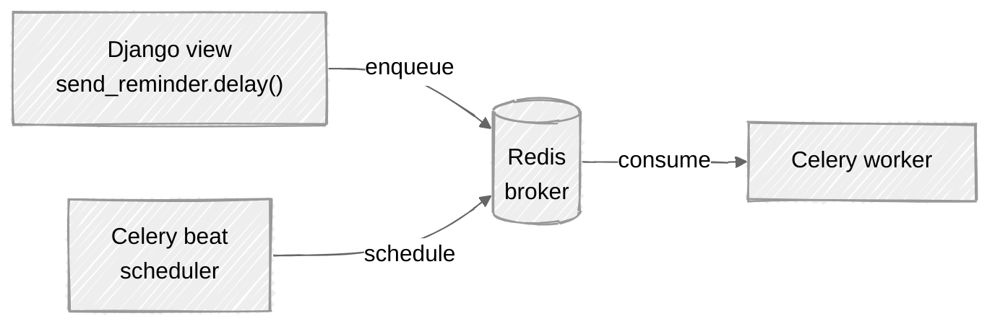

# Week 14: Celery & Async Tasks

## 🎯 Learning Objectives

- Set up Celery for background tasks
- Create and schedule async tasks
- Handle task retries and error handling
- Monitor tasks with Flower
- Use Django's async views

This week you'll wire up the async path - work is published to Redis and consumed by separate worker processes:



## 📚 Required Reading

| Resource                                                                                              | Section   | Time   |
| ----------------------------------------------------------------------------------------------------- | --------- | ------ |
| [Celery First Steps](https://docs.celeryq.dev/en/stable/getting-started/first-steps-with-celery.html) | Tutorial  | 45 min |
| [Django + Celery](https://docs.celeryq.dev/en/stable/django/first-steps-with-django.html)             | Full page | 30 min |
| [Django Async](https://docs.djangoproject.com/en/5.0/topics/async/)                                   | Overview  | 20 min |

---

## Setup

```bash
uv add celery redis
uv add --dev flower  # Monitoring
```

```python
# config/celery.py
import os
from celery import Celery

os.environ.setdefault('DJANGO_SETTINGS_MODULE', 'config.settings')

app = Celery('config')
app.config_from_object('django.conf:settings', namespace='CELERY')
app.autodiscover_tasks()

@app.task(bind=True, ignore_result=True)
def debug_task(self):
    print(f'Request: {self.request!r}')
```

```python
# config/__init__.py
from .celery import app as celery_app

__all__ = ('celery_app',)
```

```python
# config/settings.py
CELERY_BROKER_URL = 'redis://localhost:6379/0'
CELERY_RESULT_BACKEND = 'redis://localhost:6379/0'
CELERY_ACCEPT_CONTENT = ['json']
CELERY_TASK_SERIALIZER = 'json'
CELERY_RESULT_SERIALIZER = 'json'
CELERY_TIMEZONE = 'UTC'

# Email - the tasks below call send_mail(). In development, route email to the
# console so the task succeeds without an SMTP server. Override with real SMTP
# settings in production (EMAIL_HOST, EMAIL_HOST_USER, EMAIL_HOST_PASSWORD, etc.).
EMAIL_BACKEND = 'django.core.mail.backends.console.EmailBackend'

# Celery Beat (periodic tasks)
CELERY_BEAT_SCHEDULE = {
    'cleanup-old-tasks': {
        'task': 'tasks.tasks.cleanup_old_tasks',
        'schedule': 86400.0,  # Daily
    },
}
```

---

## Key Concepts

### Creating Tasks

```python
# tasks/tasks.py
from celery import shared_task
from django.core.mail import send_mail
from django.utils import timezone
from datetime import timedelta

from .models import Task, Status


@shared_task
def send_task_reminder(task_id: int) -> str:
    """Send email reminder for a task."""
    try:
        task = Task.objects.get(pk=task_id)
    except Task.DoesNotExist:
        return f'Task {task_id} not found'

    if not task.owner.email:
        # Skip: no email collected at signup. (Week 09's CustomUserCreationForm
        # has fields=('username', 'email') to prevent this; older accounts may
        # still lack one.) Returning rather than calling send_mail with an
        # empty recipient avoids SMTPRecipientsRefused + endless Celery retries.
        return f'Skipped task {task_id}: owner has no email on file'

    send_mail(
        subject=f'Reminder: {task.title}',
        message=f'Your task "{task.title}" is due on {task.due_date}',
        from_email='noreply@taskmaster.com',
        recipient_list=[task.owner.email],
    )
    return f'Reminder sent for task {task_id}'


@shared_task(
    bind=True,
    max_retries=3,
    default_retry_delay=60,
)
def process_import(self, file_path: str) -> dict:
    """Process file import with retry on failure."""
    try:
        # Process file...
        return {'status': 'success', 'records': 100}
    except Exception as exc:
        raise self.retry(exc=exc)


@shared_task
def create_task_for_user(payload: dict, user_id: int) -> int:
    """Create a Task from import payload; return the new task_id.
    Designed to chain into send_task_reminder."""
    from django.contrib.auth import get_user_model
    User = get_user_model()
    user = User.objects.get(pk=user_id)
    task = Task.objects.create(
        title=f"Imported: {payload.get('source', 'unknown')}",
        owner=user,
    )
    return task.pk      # ← int, suitable as send_task_reminder's first arg


@shared_task
def cleanup_old_tasks() -> int:
    """Delete completed tasks older than 90 days."""
    cutoff = timezone.now() - timedelta(days=90)
    deleted, _ = Task.objects.filter(
        status=Status.COMPLETED,
        completed_at__lt=cutoff
    ).delete()
    return deleted


@shared_task
def generate_report(user_id: int) -> str:
    """Generate user report (long-running task)."""
    from django.contrib.auth import get_user_model
    User = get_user_model()

    user = User.objects.get(pk=user_id)
    tasks = Task.objects.filter(owner=user)

    # Generate report...
    report_url = '/reports/user_report.pdf'

    # Notify user
    send_mail(
        subject='Your report is ready',
        message=f'Download your report: {report_url}',
        from_email='noreply@taskmaster.com',
        recipient_list=[user.email],
    )

    return report_url
```

### Calling Tasks

```python
# Async call (non-blocking)
send_task_reminder.delay(task.pk)

# With options
send_task_reminder.apply_async(
    args=[task.pk],
    countdown=60,  # Delay 60 seconds
    expires=3600,  # Expire after 1 hour
)

# Get result (blocking)
result = process_import.delay('/path/to/file.csv')
print(result.get(timeout=30))

# Chain tasks - output of step N becomes first arg of step N+1.
# Each task must accept the previous task's return type as its first arg.
# Note: process_import returns a dict {status, records}; send_task_reminder
# needs an int task_id. We bridge them with create_task_for_user, which
# accepts a dict and returns the new task's pk.
from celery import chain
chain(
    process_import.s('/file.csv'),
    create_task_for_user.s(user_id=request.user.pk),  # dict in → int out
    send_task_reminder.s(),                            # int in → reminder sent
)()
```

### Running Celery

```bash
# Start worker
uv run celery -A config worker -l info

# Start beat (scheduler)
uv run celery -A config beat -l info

# Start Flower (monitoring)
uv run celery -A config flower

# All in one (development ONLY - never in production)
# `-B` runs the beat scheduler embedded in the worker. Convenient locally,
# unsafe in prod: if the worker dies, scheduled jobs stop firing. In
# production, run `celery beat` as a separate process / container.
uv run celery -A config worker -B -l info
```

### Testing Celery tasks

In tests, set `CELERY_TASK_ALWAYS_EAGER = True` to execute tasks synchronously in-process - no broker needed:

```python
# config/settings/test.py  (or override at the test class level)
CELERY_TASK_ALWAYS_EAGER = True
CELERY_TASK_EAGER_PROPAGATES = True   # surface task errors as test failures
```

Without this, `send_task_reminder.delay(...)` in a test enqueues to a broker that doesn't exist and the test hangs or silently never runs the task.

### Django Async Views

Install the async HTTP client first:

```bash
uv add httpx
```

```python
# views.py
import asyncio
import httpx
from django.http import JsonResponse

async def fetch_external_data(request):
    """Async view for I/O-bound operations."""
    async with httpx.AsyncClient() as client:
        responses = await asyncio.gather(
            client.get('https://api.example.com/data1'),
            client.get('https://api.example.com/data2'),
        )

    return JsonResponse({
        'data1': responses[0].json(),
        'data2': responses[1].json(),
    })
```

---

## 📋 Submission Checklist

- [ ] Celery configured with Redis
- [ ] Background task for sending reminders
- [ ] Periodic task for cleanup
- [ ] Task with retry logic
- [ ] Flower monitoring accessible

---

**Next**: [Week 15: Deployment →](../week-15-deployment/readme.md)
