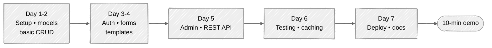

# Week 16: Capstone Project

## 🎯 Objectives

Apply everything you've learned to build a complete, production-ready Django application from scratch.

The 7-day milestone path for your capstone:



---

## Project Options

The default capstone is to **harden and finish TaskMaster** — the app you've been incrementally building from Week 03. That choice preserves the 15 weeks of investment and gives you a portfolio piece tied directly to the curriculum's architecture diagram.

If you'd rather start fresh on a different domain — totally fine; the skills transfer. Pick ONE of the options below instead.

### Option 0 (default): TaskMaster — productionize and extend

Take TaskMaster from "works on my machine" to "production-deployable" using **only what weeks 01-15 taught**:

**Core requirements (all reachable from the curriculum):**

- **Multi-user with isolation.** Owner-based queryset filtering on every view (Week 09).
- **REST API.** Owner-scoped ViewSets, throttling, CORS, token auth (Week 10).
- **Recurring tasks.** A `RecurringTaskTemplate` model + a Celery beat schedule (Week 14) that materializes due instances daily.
- **Public read-only sharing.** Use `django.core.signing.TimestampSigner` to mint expiring share links: `signer.sign_object({'task_id': pk}, ...)`. The view checks the signature with `signer.unsign_object(token, max_age=...)`. See [Django's signing docs](https://docs.djangoproject.com/en/stable/topics/signing/) for the 30-min crash course; it's stdlib Django.
- **Analytics dashboard.** Aggregations from Week 12 (annotated querysets, time-series charts).
- **Caching + N+1 hygiene.** Per-user keys for any user-scoped cache (Week 13 warning), `select_related`/`prefetch_related` on list views, `assertNumQueries` regression tests.
- **Containerized + deployed** per Week 15 — with `DJANGO_SETTINGS_MODULE=config.settings.production` set, `CSRF_TRUSTED_ORIGINS` configured, and the `X-Forwarded-Proto` story matched to your TLS termination point.
- **CI/CD.** GitHub Actions running tests + ruff + a deploy on green main (Week 15).

**Stretch (NOT reachable from this curriculum — pick one and learn it standalone if you want):**

- **Real-time updates via Django Channels + WebSockets.** Channels was *not* covered in weeks 01-15. Reach for [the Channels tutorial](https://channels.readthedocs.io/en/stable/tutorial/) and budget ~1 week. Polling with `setInterval` + the existing REST endpoints is the pragmatic substitute.
- **Outbound webhooks with HMAC signing.** Not covered. Read [Stripe's webhook signing docs](https://stripe.com/docs/webhooks/signatures) and use `hmac.compare_digest`; ~1 day of focused work. Without HMAC, the webhook is unauthenticated to the receiver.
- **Server-Sent Events for live counts.** Simpler than Channels for "push something to one client"; uses standard HTTP, no extra dependency.

The success criterion: a public URL you can demo to someone who's never seen the codebase, plus a `README` in the repo that walks through architecture and demos the key flows. The stretch items are bonuses, not requirements — the core list above is the bar.

### Option A: Blog Platform

- User registration and authentication
- Create, edit, delete posts with rich text
- Categories and tags
- Comments with moderation
- RSS feed
- Full-text search

### Option B: E-commerce Store

- Product catalog with categories
- Shopping cart (session-based)
- User accounts and order history
- Stripe payment integration
- Admin dashboard for orders

### Option C: Project Management Tool

- Team workspaces
- Project boards (Kanban-style)
- Task assignment and tracking
- File attachments
- Activity feed
- Email notifications

### Option D: Your Own Idea

- Must be approved by mentor
- Similar complexity to above options
- Must use all concepts learned

---

## Requirements

### Must Have (Core Features)

1. **Authentication**

   - Custom user model
   - Registration, login, logout
   - Password reset
   - Profile management

2. **Models & Database**

   - Minimum 5 models with relationships
   - Proper migrations
   - Data validation

3. **Views**

   - Mix of FBV and CBV
   - Proper error handling
   - Pagination

4. **Templates**

   - Template inheritance
   - Responsive design
   - Custom template tags/filters

5. **Forms**

   - ModelForms with validation
   - File upload handling

6. **Admin**

   - Customized admin interface
   - Custom actions

7. **API**

   - REST API with DRF
   - Token authentication
   - Proper serializers

8. **Testing**
   - 80%+ test coverage
   - Model, view, and API tests
   - Factories for test data

### Should Have (Production Features)

9. **Caching**

   - Redis caching
   - View and template caching

10. **Background Tasks**

    - At least 2 Celery tasks
    - Email notifications

11. **Deployment**
    - Docker configuration
    - CI/CD pipeline
    - Production settings

### Nice to Have (Extra Credit)

12. **Advanced Features**
    - Real-time features (WebSockets)
    - Third-party integrations
    - Advanced search (Elasticsearch)
    - Multi-tenancy
    - Internationalization

---

## Project Structure

```
capstone-project/
├── .github/
│   └── workflows/
│       └── ci.yml
├── config/
│   ├── __init__.py
│   ├── celery.py
│   ├── settings/
│   │   ├── __init__.py
│   │   ├── base.py
│   │   ├── development.py
│   │   └── production.py
│   ├── urls.py
│   └── wsgi.py
├── apps/
│   ├── accounts/
│   ├── core/
│   └── [your_app]/
├── templates/
├── static/
├── tests/
├── docker-compose.yml
├── Dockerfile
├── pyproject.toml
├── uv.lock
├── README.md
└── manage.py
```

---

## Grading Rubric

| Category          | Points | Description                             |
| ----------------- | ------ | --------------------------------------- |
| **Functionality** | 30     | All features work correctly             |
| **Code Quality**  | 20     | Clean, readable, follows best practices |
| **Testing**       | 15     | Comprehensive tests, good coverage      |
| **Documentation** | 10     | Clear README, API docs, code comments   |
| **Deployment**    | 10     | Docker works, CI/CD pipeline            |
| **Security**      | 10     | Follows security checklist              |
| **UI/UX**         | 5      | Clean, responsive design                |

---

## Deliverables

1. **GitHub Repository**

   - Clean commit history
   - Proper branching strategy
   - Pull request workflow

2. **README.md** with:

   - Project description
   - Features list
   - Installation instructions
   - API documentation
   - Screenshots

3. **Presentation**
   - 10-minute demo
   - Architecture overview
   - Challenges and solutions
   - Future improvements

---

## Timeline

| Day | Milestone                         |
| --- | --------------------------------- |
| 1-2 | Project setup, models, basic CRUD |
| 3-4 | Authentication, forms, templates  |
| 5   | Admin customization, API          |
| 6   | Testing, caching                  |
| 7   | Deployment, documentation         |

---

## Submission

1. Push final code to GitHub
2. Deploy to a hosting platform (optional but recommended)
3. Submit repository URL
4. Schedule presentation with mentor

---

## 🎓 Congratulations!

If you've completed all 16 weeks, you now have:

- Deep understanding of Django's architecture
- Experience with modern Python tooling (uv, ruff, pytest)
- Knowledge of REST API development
- Testing and deployment skills
- A portfolio project to showcase

**You're ready to build production Django applications!**

---

## What's Next?

- Contribute to open-source Django projects
- Explore Django Channels for WebSockets
- Learn GraphQL with Graphene-Django
- Study Django performance optimization
- Join the Django community (DjangoCon, local meetups)

---

**Thank you for completing the Django Mentorship Program!**
