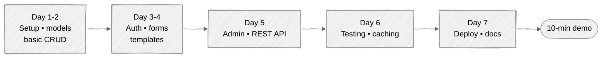

# Week 16: Capstone Project

## 🎯 Objectives

Apply everything you've learned to build a complete, production-ready Django application from scratch.

The 7-day milestone path for your capstone:



---

## Project Options

Choose ONE of the following projects:

### Option A: Blog Platform

- User registration and authentication
- Create, edit, delete posts with rich text
- Categories and tags
- Comments with moderation
- RSS feed
- Full-text search

### Option B: E-commerce Store

- Product catalog with categories
- Shopping cart (session-based)
- User accounts and order history
- Stripe payment integration
- Admin dashboard for orders

### Option C: Project Management Tool

- Team workspaces
- Project boards (Kanban-style)
- Task assignment and tracking
- File attachments
- Activity feed
- Email notifications

### Option D: Your Own Idea

- Must be approved by mentor
- Similar complexity to above options
- Must use all concepts learned

---

## Requirements

### Must Have (Core Features)

1. **Authentication**

   - Custom user model
   - Registration, login, logout
   - Password reset
   - Profile management

2. **Models & Database**

   - Minimum 5 models with relationships
   - Proper migrations
   - Data validation

3. **Views**

   - Mix of FBV and CBV
   - Proper error handling
   - Pagination

4. **Templates**

   - Template inheritance
   - Responsive design
   - Custom template tags/filters

5. **Forms**

   - ModelForms with validation
   - File upload handling

6. **Admin**

   - Customized admin interface
   - Custom actions

7. **API**

   - REST API with DRF
   - Token authentication
   - Proper serializers

8. **Testing**
   - 80%+ test coverage
   - Model, view, and API tests
   - Factories for test data

### Should Have (Production Features)

9. **Caching**

   - Redis caching
   - View and template caching

10. **Background Tasks**

    - At least 2 Celery tasks
    - Email notifications

11. **Deployment**
    - Docker configuration
    - CI/CD pipeline
    - Production settings

### Nice to Have (Extra Credit)

12. **Advanced Features**
    - Real-time features (WebSockets)
    - Third-party integrations
    - Advanced search (Elasticsearch)
    - Multi-tenancy
    - Internationalization

---

## Project Structure

```
capstone-project/
├── .github/
│   └── workflows/
│       └── ci.yml
├── config/
│   ├── __init__.py
│   ├── celery.py
│   ├── settings/
│   │   ├── __init__.py
│   │   ├── base.py
│   │   ├── development.py
│   │   └── production.py
│   ├── urls.py
│   └── wsgi.py
├── apps/
│   ├── accounts/
│   ├── core/
│   └── [your_app]/
├── templates/
├── static/
├── tests/
├── docker-compose.yml
├── Dockerfile
├── pyproject.toml
├── uv.lock
├── README.md
└── manage.py
```

---

## Grading Rubric

| Category          | Points | Description                             |
| ----------------- | ------ | --------------------------------------- |
| **Functionality** | 30     | All features work correctly             |
| **Code Quality**  | 20     | Clean, readable, follows best practices |
| **Testing**       | 15     | Comprehensive tests, good coverage      |
| **Documentation** | 10     | Clear README, API docs, code comments   |
| **Deployment**    | 10     | Docker works, CI/CD pipeline            |
| **Security**      | 10     | Follows security checklist              |
| **UI/UX**         | 5      | Clean, responsive design                |

---

## Deliverables

1. **GitHub Repository**

   - Clean commit history
   - Proper branching strategy
   - Pull request workflow

2. **README.md** with:

   - Project description
   - Features list
   - Installation instructions
   - API documentation
   - Screenshots

3. **Presentation**
   - 10-minute demo
   - Architecture overview
   - Challenges and solutions
   - Future improvements

---

## Timeline

| Day | Milestone                         |
| --- | --------------------------------- |
| 1-2 | Project setup, models, basic CRUD |
| 3-4 | Authentication, forms, templates  |
| 5   | Admin customization, API          |
| 6   | Testing, caching                  |
| 7   | Deployment, documentation         |

---

## Submission

1. Push final code to GitHub
2. Deploy to a hosting platform (optional but recommended)
3. Submit repository URL
4. Schedule presentation with mentor

---

## 🎓 Congratulations!

If you've completed all 16 weeks, you now have:

- Deep understanding of Django's architecture
- Experience with modern Python tooling (uv, ruff, pytest)
- Knowledge of REST API development
- Testing and deployment skills
- A portfolio project to showcase

**You're ready to build production Django applications!**

---

## What's Next?

- Contribute to open-source Django projects
- Explore Django Channels for WebSockets
- Learn GraphQL with Graphene-Django
- Study Django performance optimization
- Join the Django community (DjangoCon, local meetups)

---

**Thank you for completing the Django Mentorship Program!**
